
基于物理的流体渲染 ——从理论到实践

[TOC]

# 
数学理论

## 微积分

### 导数

### 微分

### 积分

### 全导数

### 偏微分 (Partial Derivative)

### 全微分

## 向量微积分

### 梯度  (Gradient)

在向量微积分中，**梯度** (gradient) 是一种关于多元导数的概括。平常的一元（单变量）函数的导数是标量值函数，而多元函数的梯度是向量值函数。多元可微函数 $f$ 在点 $\vec{P}$ 上的梯度，是以 $f$ 在 $\vec{P}$ 上的偏导数为分量的向量。就像一元函数的导数表示这个函数图形的切线的斜率，如果多元函数在点 $\vec{P}$ 上的梯度不是零向量，则它的方向是这个函数在 $\vec{P}$ 上最大增长的方向，而它的量是在这个方向上的增长率。

梯度向量中的幅值和方向是与坐标的选择无关的独立量。

将 2D 函数 $f(x, y) = xe^{−(x^2 + y^2)}$ 的梯度绘制为蓝色箭头，还绘制了这个函数的伪色图。

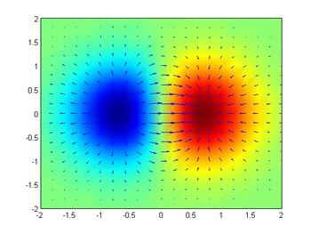

将函数 $f(x,y) = −(cos^2x + cos^2y)^2$ 的梯度描绘为在底面上投影的向量场。

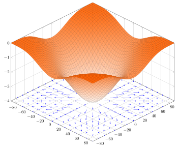

#### 梯度的解释

假设有一个房间，房间内所有逇点的温度由一个标量场 $\phi$ 给出的，即点 (x, y, z) 的温度是 $\phi (x, y, z)$ 。假设温度不随时间变化。然后，在房间的每一点，该点的梯度将显示变热最快的方向。梯度的大小将表示在该方向上变热的速率。

考虑一座高度在 (x, y) 点的 H (x, y) 的山。H 这一点的梯度是在该点坡度（或者说斜度）最陡的方向。梯度的大小告诉我们坡度到底有多陡。

梯度也可以告诉我们一个数量在不是最快变化方向的其他方向的变化速度。再次考虑山坡的例子。可以有条直接上山的路，其坡度是最大的，则其坡度是梯度的大小。也可以有一条和上坡方向成一个角度的路，例如投影与水平面上的夹角为 60°。则，若最陡的坡度是 40%，这条路的坡度小一点，是 20%，也就是 40% 乘以 60% 的余弦。

这个现象也可以如下数学的表示。山的高度函数 H 的梯度点积一个单位向量给出表面在该向量的方向上的斜率，这成为方向导数。

#### 定义

标量函数 $f$ : $\R^n \mapsto \R$ 的梯度表示为：$\nabla{f}$ 或 grad $f$ ，其中 $\nabla$ 表示向量微分算子。

函数 $f$ 的梯度，$\nabla f$，为向量场且对任意单位向量 $\vec{v}$ 满足下列方程：
$$
(\nabla{f(x)}) \cdot \vec{v} = D_v f(x)
$$
二维直角坐标系的梯度如下：
$$
\nabla{f(x, y)} = \begin{pmatrix} \frac{\partial{f}}{\partial{x}}, \frac{\partial{f}}{\partial{y}} \end{pmatrix} = \frac{\partial{f}}{\partial{x}} \vec{i} + \frac{\partial{f}}{\partial{y}} \vec{j}
$$
三维直角坐标系的梯度如下：
$$
\nabla{f(x, y, z)} = \begin{pmatrix} \frac{\partial{f}}{\partial {x}}, \frac{\partial{f}}{\partial(y)}, \frac{\partial{f}}{\partial{z}} \end{pmatrix} = \frac{\partial{f}}{\partial{x}} \vec{i} + \frac{\partial{f}}{\partial{y}} \vec{j} + \frac{\partial{f}}{\partial{z}} \vec{k}
$$

其中 $\vec{i}$、$\vec{j}$、$\vec{k}$ 为标准的单位向量，分别指向 x, y, z 坐标的方向。

有时也会采用如下形式来表示梯度：
$$
\nabla{f} = \frac{\partial{f}}{\partial{\vec{x}}}
$$
多个函数的梯度构成了一个矩阵：
$$
\nabla{\vec{F}} = \nabla{(f, g, h)} = 
\begin{pmatrix} 
\frac{\partial{f}}{\partial{x}} & \frac{\partial{f}}{\partial{y}} & \frac{\partial{f}}{\partial{z}} \\
\frac{\partial{g}}{\partial{x}} & \frac{\partial{g}}{\partial{y}} & \frac{\partial{g}}{\partial{z}} \\
\frac{\partial{h}}{\partial{x}} & \frac{\partial{h}}{\partial{y}} & \frac{\partial{h}}{\partial{z}} \\
\end{pmatrix}
=
\begin{pmatrix}
\nabla{f} \\ \nabla{g} \\ \nabla{h}
\end{pmatrix}
$$

### 散度 (Divergence)

**散度** (Divergence) 或称发散度，是向量分析中的一个向量算子，将向量空间上的一个向量场对应到一个标量场上。散度描述的是向量场里一个点是汇聚点 (sink) 还是发源点 (source)。形象地说，就是这包含这一点的一个微小体元中的向量是“向外”居多还是“向内”居多。

举例来说，考虑空间中的静电场，其空间里的电场强度是一个向量场。正电荷附近，电场线“向外”发射，所以正电荷处的散度为正值，电荷越大，散度越大。负电荷附近，电场线“向内”，所以负电荷处的散度为负值，电荷越大，散度越小。向量值函数的散度为一个标量，而二阶张亮的散度是向量值函数。

#### 定义

定义向量场的散度，在给定一个三维空间中的向量场 **A** 以及一个简单有向曲面 $\Sigma$ ，则向量场 **A** 通过曲面 $\Sigma$ 的通量就是曲面每一点 $\vec{x}$ 上的场向量 **A($\vec{x}$)** 在曲面法方向上的分量的积分：
$$
\Phi_{\pmb{A}}(\Sigma) = \iint_\Sigma \pmb{A} \cdot \vec{n} \mathrm{d} \pmb{S}
$$
其中 $dS$ 是积分的面积元，$\vec{n}$ 是 $\Sigma$ 在点 (x, y, z) 处的单位法向量。如果曲面是封闭的，例如球面，那么通常约定法向量是从里朝外的，所以这时候的通量是描述曲面上的场向量朝外的程度。

通量描述一固定区域（也就是 $\Sigma$ ）上向量场的流通倾向，散度在某点的值则是这个性质在这点的局部描述，也就是说，从散度在一点的值，我们可以看出向量场在这点附近到底倾向发散还是收敛。要算某一点 $\vec{x}$ 的散度，先求包含这一点的某一个封闭曲面 $\Sigma$ 的通量 $\Phi_{\pmb{A}}(\Sigma)$ 除以封闭曲面 $\Sigma$ 围起来的微小体元 $\delta{\pmb{V}}$ 的体积（这个体积用 $|\delta{\pmb{V}}|$ 表示）得到的比值，向量场 **A** 在点 $\vec{x}$ 的散度即是这个比值在体积微元 $\delta{V}$ 趋向于点 $\vec{x}$ 时的极限。用数学公式表示即：
$$
div \pmb{A} = \lim_{\delta{\pmb{V}} \to {\vec{x}}} \oint_\Sigma \frac{\pmb{A} \cdot \vec{n}}{|\delta{\pmb{V}}|} \mathrm{d} \pmb{S} = \lim_{\delta{\pmb{V}} \to \vec{x}} \frac{\Phi_{\pmb{A}}(\Sigma)}{|\delta{\pmb{V}}|}
$$
如果用 $\nabla$  算子表示的话，向量场 **A** 的散度记作：$div \pmb{A} = \nabla \cdot \pmb{A}$ 

#### 物理意义

从定义中可以看到，散度是向量场的一种强度性质，就如同密度、浓度、温度一样，它对应的广延性质是一个封闭区域表面的通量，所以说散度是通量的体密度。下面从散度的极限表达式来看它的物理意义。

设 $\vec{P}$ 为场域 **V** 中的一点，现做包围 $\vec{P}$ 点的任一闭合曲面 **S** ，$\Delta{\pmb{V}}$ 是 S 面所围的区域。那么：
$$
\oint_{\pmb{S}} \pmb{A} \cdot \mathrm{d} \pmb{S} = \iiint_{\Delta{\pmb{V}}} div \pmb{A} \mathrm{d} \pmb{V}
$$
利用中值定理得
$$
\iiint_{\Delta{\pmb{V}}} div \pmb{A} \mathrm{d} \pmb{V} = (div \pmb{A})_x \cdot \left| \Delta{\pmb{V}} \right|
$$
式中 $\vec{x}$ 为 $\Delta{\pmb{V}}$ 中的某一点，$\left| \Delta{\pmb{V}} \right|$ 为 $\Delta{\pmb{V}}$ 的体积，带入上式后得
$$
\left(div \pmb{A}\right)_\vec{x} = \frac{1}{\left|\Delta{\pmb{V}}\right|} \oint_{\pmb{s}} \pmb{A} \cdot \mathrm{d} \pmb{S}
$$
令 $\Delta{\pmb{V}}$ 向点 $\vec{P}$  收缩，则 $\vec{x}$ 点就趋向于 $\vec{P}$ ，所以在 $\vec{P}$ 点的散度可由下列极限表示
$$
\left(div \pmb{A} \right)_\vec{p} = \lim_{\Delta{\pmb{V}} \to \vec{P}} \frac{1}{\left| \Delta{\pmb{V}} \right|} \oint_{\pmb{S}} \pmb{A} \cdot \mathrm{d} \pmb{S}
$$
若上式中令 $\Delta{\pmb{\Phi}} = \oint_{\pmb{S}} \pmb{A} \cdot \mathrm{d} \pmb{S}$ ，那么
$$
\left( div \pmb{A}_\vec{P} \right) = \lim_{\Delta \pmb{V} \to \vec{P}} \frac{1}{\left|\Delta{\pmb{V}} \right|} \oint_\pmb{S} \pmb{A} \cdot \mathrm{d} \pmb{S} = \lim_{\Delta{\pmb{V}} \to \vec{P}} \frac{\Delta \pmb{\Phi}}{\left| \Delta \pmb{V}\right|} = \frac{\mathrm{d} \pmb{\Phi}}{\mathrm{d} \pmb{V}}
$$
由此可见，散度是通量 $\pmb{\Phi}$ 对曲面所谓区域体积的变化率，也可看成通量在 **V** 中的分布密度。所以 div **A** 也称通量密度。

物理上，散度的意义是场的有源性。某一点或某个区域的散度大于零，表示向量场在这一点或这以区域有新的通量产生，小于零则表示向量场在这一点或区域有通量湮灭。这样的点或区域分别成为向量场的正源（发散源）和负源（洞）。举例来说，假设讲太空中各个点的热辐射强度向量看做一个向量场，那么某个热辐射源（比如太阳）周边的热辐射强度向量都指向外，说明太阳是不断产生新的热辐射的源头，其散度大于零。

散度等于零的区域称为无源场或管形场。流体力学中，散度为零的流体称为不可压缩流体，也就是说此流体中不会有一部分凭空消失或者突然产生，每个微小时间间隔中流入一个微小体元的流体总量都等于在此时间间隔内流出此体元的流体总量。

#### 散度的表示

不同的向量场的散度。向量场自点 (x,y) 的散度等于它在这个点上的 x 分量关于 x 的偏导数与 y 分量关于 y 的偏导数的和：

$$
\nabla \cdot (\vec{V}(x, y)) = \frac{\partial{\vec{V}_x(x, y)}}{\partial{x}} + \frac{\partial{\vec{V}_y(x, y)}}{\partial{y}}
$$
二维直角坐标系的散度如下：
$$
\nabla \cdot \vec{u} = \nabla \cdot (u, v) = \frac{\partial{u}}{\partial{x}} + \frac{\partial{v}}{\partial{y}}
$$

三维直角坐标系的散度如下：
$$
\nabla \cdot \vec{u} = \nabla \cdot (u, v, w) = \frac{\partial{u}}{\partial{x}} + \frac{\partial{v}}{\partial{y}} + \frac{\partial{w}}{\partial{z}}
$$
输入是向量，而输出为标量。类比梯度，散度符号 $\nabla \cdot \vec{u}$ 可以理解为梯度 $\nabla$ 与向量 $\vec{u}$ 的点乘：
$$
\nabla \cdot \vec{u} = 
\begin{pmatrix} 
\frac{\partial{}}{\partial{x}}, \frac{\partial{}}{\partial{y}}, \frac{\partial{}}{\partial{z}}
\end{pmatrix}
\cdot
(u, v, w)
=
\frac{\partial{}}{\partial{x}}u + \frac{\partial{}}{\partial{y}}v + 
\frac{\partial{}}{\partial{z}}w
$$

#### 高斯散度定理

既然向量场某一处的散度是向量场在该处附近通量的体密度，那么对某一个体积内的散度进行积分，就应该得到这个体积内的总通量。事实上可以证明这个推论是正确的，称为高斯散度定理。高斯定理说明，如果体积 **V** 内的向量场 **A** 拥有散度，那么散度的体积分等于向量场在 **V** 的表面 **S** 的免积分：
$$
\iiint_{\pmb{V}} div \pmb{A} \mathrm{d} v = \oiint_{\pmb{S}} \pmb{A} \cdot \vec{n}\mathrm{d} \pmb{S}
$$

### 旋度 (Curl)

### 拉普拉斯算子 (Laplacian)

## 泰勒展开

$$
f(x) = g(x) = g(x_0) + \frac{f^1(x)}{1!} (x-x_0) + \frac{f^2(x)}{2!} (x-x_0)^2 + \cdots + \frac{f^n(x)}{n!} (x-x_0)^n + \cdots
$$

$$
f(x + \Delta{x}) = f(x) + \frac{\partial{f}}{\partial{x}} \frac{\Delta{x}}{1!} + \frac{\partial^2{f}}{\partial{x}^2} \frac{\Delta{x}^2}{2!} + \cdots + \frac{\partial^n{x}}{\partial{x}^n} \frac{\Delta{x}^n}{n!} + \cdots
$$

## 牛顿-拉夫森迭代

$$
x_{n+1} = x_n - \frac{f(x_n)}{f'(x_n)}
$$

## 线性方程组解法

$$
\pmb{A} \vec{x} = \vec{b}
$$

其中 $\pmb{A}, \vec{x}, \vec{b}$ 分别为：
$$
\pmb{A} = 
\begin{bmatrix}
a_{11} & a_{12} & \cdots & a_{1n} \\
a_{21} & a_{22} & \cdots & a_{2n} \\
\vdots & \vdots & \ddots & \vdots \\
a_{n1} & a_{n2} & \cdots & a_{nn}
\end{bmatrix} , 
\qquad
\vec{x} = \begin{bmatrix} x_1 \\ x_2 \\ \vdots \\ x_n \end{bmatrix} ,
\qquad
\vec{b} = \begin{bmatrix} b_1 \\ b_2 \\ \vdots \\ b_n \end{bmatrix}
$$
这里 $\pmb{A}$ 是个 $N$ 维矩阵，$\vec{x}$ 就是该方程组的解，$\vec{b}$ 就是一个已知向量。这里讨论如何这个方程的解集 $\vec{x}$ 。

### 直接求解方式

直接的方式，就是求矩阵 $\pmb{A}$ 的逆矩阵 $\pmb{A}^{-1}$ ，即：
$$
\vec{x} = \pmb{A}^{-1} \vec{b}
$$
这里的时间复杂度为 $O(N^3)$ ，这里的 $N$ 是指矩阵维数。

### 间接求解方式

与直接方式对应的，有另外一种方式求得方程组的解，是基于开始猜测并且迭代多次得到近似值。这个计算要预定义阈值以表明近似解已经到达足够精度了。这就是间接方式。

#### 雅可比迭代法（Jacobi Method）

假设 $\pmb{A}$ 是个对角矩阵，即对角线上元素为 $a_{ii}$ ，其他非对角线上的元素均为 0。则矩阵 $\pmb{A}$ 的逆矩阵是 $\pmb{A}^{-1}$ 的对角元素为 $1/a_{ii}$ 。如果 $\pmb{A}$ 不是对角矩阵，但是对角元素也是占多数的，我们可以假设 $\pmb{A}^{-1}$ 近似于 $\pmb{D}^{-1}$ ，这里的 $\pmb{D}$ 是矩阵 $\pmb{A}$ 的对角部分。则开头的等式可以写成：
$$
(\pmb{D} + \pmb{R}) \vec{x} = \vec{b}
$$
这里的 $\pmb{R} = \pmb{A} - \pmb{D}$ ，则等式变形为：
$$
\begin{align}
\pmb{D} \vec{x} &= \vec{b} - \pmb{R} \vec{x} \\
\vec{x} &= \pmb{D}^{-1} (\vec{b} - \pmb{R} \vec{x})
\end{align}
$$
上式中如果 $\vec{x}$ 是正确解，则方程可解。但是如果左边的 $\vec{x}$ 和右边的 $\vec{x}$ 不相同时，把一个新的 $\vec{x}$ 带入右边，会导致左边有不相同的 $\vec{x}$ 。我们一直这样迭代 ，直到两边 $\vec{x}$ 相同，即：
$$
\vec{x}^{k+1} = \pmb{D}^{-1} (\vec{b} - \pmb{R} \vec{x}^k)
$$
我们把上式写成另外一种形式：
$$
x_i^{k+1} = \frac{1}{a_{ii}} \left(b_i - \sum_{j \ne i} a_{ij}x_j^k\right)
$$
这里的 $k$ 是迭代次数。这个过程就叫雅可比迭代。该方法叫雅可比法。从上式来看，如果该矩阵是对角矩阵，则 $\pmb{R}$ 就是零矩阵。因此，我们只需要一次迭代就可以获得方程正确解。如果对角矩阵 $\pmb{D}$ 有许多非零元素，则需要更多迭代才能收敛。一般来说，雅可比方法的时间复杂度是 $O(N^2)$ 。

迭代精度为：
$$
\parallel \vec{x}^{k+1} - \vec{x}^k \parallel \le \epsilon \parallel \vec{x}^k \parallel
$$
其中 $k$ 是指迭代次数，而不是指数；$\epsilon$ 是指定最小误差值。

**注意：**使用迭代法求解时需要注意迭代的收敛性。当线性方程组中的系数矩阵 $\pmb{A}$ 为严格对角优势矩阵，即 $\pmb{A}$ 的每一行对角元素的绝对值都大于同行其他元素的绝对值之和，此时可证明雅可比迭代是收敛的。

#### 高斯-赛德尔迭代法（Gauss-Seidel Method）

要加速雅可比迭代的收敛，让我们传入比对角更多信息到等式右边。跟雅可比类似，我们把等式 (20) 变形如下：
$$
(\pmb{L} + \pmb{U}) \vec{x} = \vec{b}
$$
其中矩阵 $\pmb{U}$ 表示上三角矩阵，矩阵 $\pmb{L}$ 是 $ \pmb{A} - \pmb{U}$ 。这里进一步变形为：
$$
\pmb{L} \vec{x} = \vec{b} - \pmb{U} \vec{x}
$$
这里不像对角矩阵，求三角矩阵 $\pmb{L}$ 的逆不是一个小事情，是需要使用前述的直接法计算获得。但是，如果你仔细观察方程，你会发现，$\vec{x}$ 的第一个元素 $x_1$ 是很容易通过以下计算获得：
$$
x_1^{k+1} = \frac{1}{a_{11}} \left( b_1 - \sum_{j>1}^{n}{a_{1j}x_j^k}\right)
$$
根据雅可比迭代，第二项是：
$$
x_2^{k+1} = \frac{1}{a_{22}} \left(b_2 - \sum_{j \ne 2} a_{2j}x_j^k \right)
$$
现在我们已经获得了 $x_1^{k+1}$ ，我们把该解带入到方程的第二行，可得：
$$
x_2^{k+1} = \frac{1}{a_{22}} \left( b_2 - a_{21}x_1^{k+1} - \sum_{j>1}^{n}a_{1j}x_j^k \right)
$$
根据上述推导给出一般形式：
$$
x_i^{k+1} = \frac{1}{a_{ii}} \left( b_i - \sum_{j=1}^{i-1}a_{ij}x_j^{k+1} - \sum_{j=i+1}^{n} a_{ij}x_j^k\right)
$$
从上述等式看出，这里没有求矩阵 $\pmb{L}$ 的逆，而是迭代求解。这个方法叫高斯-赛德尔法。注意到这里面只有 $\sum_{j>i}a_{ij}x_j^{k+1}$ 这项是高斯-赛德尔和雅可比法不同的。这一项是前一行计算获得的解，因此，高斯-赛德尔法比雅可比法更快收敛。当然，高斯-赛德尔法的时间复杂度跟雅可比法一样，依然是 $O(N^2)$ 。

#### 逐次超松弛迭代法（Successive Over-Relaxation Method）

一般而言，因雅可比迭代收敛速度不够快，所以在工程中应用不多。并且在雅可比迭代收敛速度很慢的情况下，通常高斯-赛德尔方法也不会很快。我们可以对高斯-赛德尔方法做出一定的修改，来提高收敛速度。这里，我们介绍逐次超松弛迭代法。

考虑高斯-赛德尔迭代：
$$
\begin{align}
x_i^{k+1} 
&= \frac{1}{a_{ii}} \left( b_i - \sum_{j=1}^{i-1}a_{ij}x_j^{k+1} - \sum_{j=i+1}^{n} a_{ij}x_j^k\right) \\
&= \frac{1}{a_{ii}}b_i - \frac{1}{a_{ii}}\sum_{j=1}^{i-1}a_{ij}x_j^{k+1} - \frac{1}{a_{ii}}\sum_{j=i+1}^n a_{ij}x_j^k \\
&= \frac{1}{a_{ii}}b_i - \frac{1}{a_{ii}}\sum_{j=1}^{i-1}a_{ij}x_j^{k+1} - \frac{1}{a_{ii}}\sum_{j=i}^na_{ij}x_j^k + x_i^k \\
&= x_i^k + \frac{1}{a_{ii}}\left(b_i - \sum_{j=1}^{i-1}a_{ij}x_j^{k+1} - \sum_{j=i}^n a_{ij} x_j^k \right)
\end{align}
$$
令：
$$
\begin{align}
r_i^k &= x_i^{k+1} - x_i^k \\
&= \frac{1}{a_{ii}}\left(b_i - \sum_{j=1}^{i-1}a_{ij}x_j^{k+1} - \sum_{j=i}^n a_{ij}x_j^k \right)
\end{align}
$$
这里 $r_i^k$ 为第 $k+1$ 次迭代时 $x_i$ 的改变量，因此：
$$
x_i^{k+1} = x_i^k + r_i^k
$$
在改变量 $r_i^k$ 前加一个因子 $\omega, (0 < \omega < 2)$  ，得：
$$
\begin{align}
x_i^{k+1} &= x_i^k + \omega r_i^k \\
&= x_i^k + \frac{\omega}{a_{ii}}\left(b_i - \sum_{j=1}^{i-1} a_{ij}x_j^{k+1} - \sum_{j=i}^n a_{ij}x_j^k \right)
\end{align}
$$
合并 $x_i^k$ 项，可得：
$$
x_i^{k+1} = (1-\omega)x_i^k + \frac{\omega}{a_{ii}}\left(b_i - \sum_{j=1}^{i-1}a_{ij}x_j^{k+1} - \sum_{j=i+1}^na_{ij}x_j^k \right)
$$

#### 总结

前面讨论了雅可比迭代法和高斯-赛德尔迭代法，由于雅可比迭代不依赖上一次迭代结果，所以雅可比迭代法可以更好的用并行计算实现，而高斯-赛德尔迭代法因为依赖前一行的计算结果，所以无法并行。这里简单列出几个方面的比较：

|     迭代法      |                             公式                             | 收敛速度 | 可并行性 | 时间复杂度 |
| :-------------: | :----------------------------------------------------------: | :------: | :------: | :--------: |
|   雅克比迭代    | $x_i^{k+1} = \frac{1}{a_{ii}}\left(b_i - \sum_{j \ne i}a_{ij}x_j^k \right)$ |    慢    |   可以   |  $O(N^2)$  |
| 高斯-赛德尔迭代 | $x_i^{k+1} = \frac{1}{a_{ii}} \left( b_i - \sum_{j>i}a_{ij}x_j^{k+1} - \sum_{j>i} a_{ij}x_j^k\right)$ |    快    |  不可以  |  $O(N^2)$  |

## 插值

### Nearest Point
$$
f_{nearest}(t) = \begin{cases} f_0 \quad & 0 \le t < 0.5 \\ f_1 \quad & 0.5 \le t \le 1 \end{cases}
$$
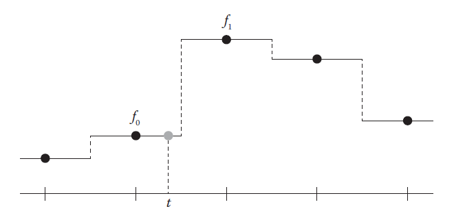

附近点近似法

### Linear Interpolation

#### 线性插值
$$
f_{linear}(t) = (1 - t) \cdot f_0 + t \cdot f_1
$$
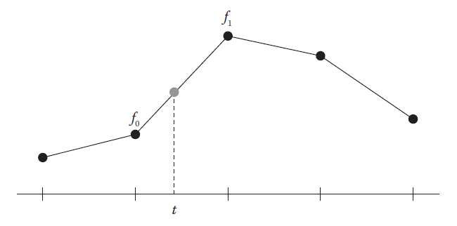

线性插值

#### 双线性插值
$$
\begin{align}
f_{linear}(t_x) &= (1-t_x) \cdot f_{00} + t_x \cdot f_{10} \\
f_{linear}(t_y) &= (1-t_x) \cdot f_{01} + t_x \cdot f_{11} \\
f_{bilinear}(t_x, t_y) &= (1-t_y) \cdot f_{linear}(t_x) + t_y \cdot f_{linear}(t_x)
\end{align}
$$
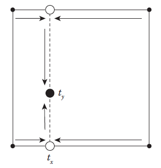

双线性插值

#### 三线性插值
$$
\begin{align}
A &= f_{bilinear}(t_x, t_y) \\
B &= f_{bilinear}(t_x, t_y) \\
f_{trilinear}(t_x, t_y, t_z) &= (1 - t_z) \cdot A + t_z \cdot B
\end{align}
$$

三线性插值

不管是线性插值、双线性插值还是三线性插值，都跟顺序无关，上述的都是先 x 轴，再 y 轴，最后 z 轴。如果展开层叠的函数调用，你回发现，都是每一个角的值乘以插值点对面的区域的面积（2D）或体积（3D)。如下图所示：

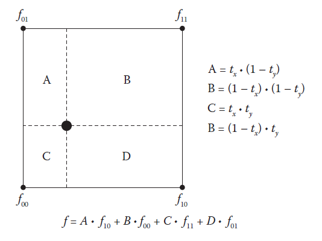

双线性插值按照加权平均的解释

### Catmull Rom Spline Interpolation
$$
f(t) = a_3 t^3 + a_2 t^2 + a_1 t + a_0
$$
这里面有 $a_3, a_2, a_1, a_0$ 四个数都未知。现在让我们设四个点，分设 $f_0, f_1, f_2, f_3$ 为对应 $f(t)$ 在 $t = -1, 0, 1, 2$ 时的值，则：
$$
\begin{align}
f_0 &= f(-1) = -a_3 + a_2 - a_1 + a_0 \\
f_1 &= f(0) = a_0 \\
f_2 &= f(1) = a_3 + a_2 + a_1 + a_0 \\
f_3 &= f(2) = 8a_3 + 4a_2 + 2a_1 + a_0
\end{align}
$$
那么现在我们就能知道 $a_0$ 就是 $f_1$ 。然后我们对 $f(t)$ 求导：
$$
f'(t) = d(t) = 3a_3t^2 + 2a_2t + a_1
$$
通过以下式子拟合 $d(t)$ 在 $t=0, t=1$ 时的值：
$$
\begin{align}
d(0) &= d_1 = \frac{f_2 - f_0}{2} \\
d(1) &= d_2 = \frac{f_3 - f_1}{2}
\end{align}
$$
这表示 $d_1$ 和 $d_2$ 是在 0 和 1 点的斜率的一半。这可以看出来 $a_1$ 的解是 $d_1 = (f_2 - f_0) / 2$ 。现在还剩下 $a_2$ 和 $a_3$ 。这是可以让 $t = 1$ ，然后得线性方程组：
$$
\begin{cases}
f_2 = a_3 + a_2 + a_1 + a_0 \\
d_2 = 3a_3 + 2a_2 + a_1
\end{cases}
$$
解上述方程组可得 $a_2$ 和 $a_3$ 。最终可解得：
$$
\begin{align}
a_0 &= f_1 \\
a_1 &= \frac{(f_2 - f_0)}{2} \\
a_2 &= 3(f_2 - f_1) - 2(\frac{f_2 - f_0}{2}) - \frac{f_3 - f_1}{2} \\
a_3 &= \frac{f_2 - f_0}{2} + \frac{f_3 - f_1}{2} - 2(f_2 - f_1)
\end{align}
$$
把上述求得的 $a_0,  a_1, a_2, a_3$ 带入等式 (40) ，这就是 Catmull-Rom 三次样条插值。

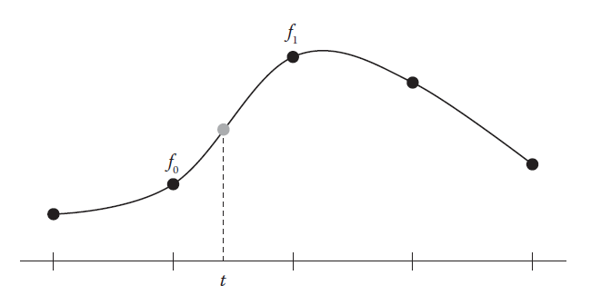 

Catmull-Rom 三次样条插值

## 拉格朗日乘子

在讨论约束投影之前，先看一个数值优化问题，拉格朗日乘子。

### 一个最短路径问题

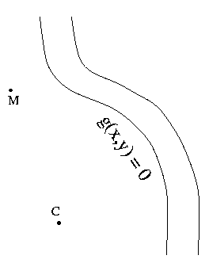

假设你在 $\vec{M}$ 点，需要先到河边（上图右侧曲线）再回到 $\vec{C}$ 点，如何规划路径最短？

> 假设河流曲线满足方程 $g(x, y) = 0$ （例如 它是一个圆：$g(x, y） = x^2 + y^2 - r^2 = 0$ ）。用 $\vec{P}$ 表示河边山的任意 $\vec{P}(x, y)$ 点，用 $d(\vec{M}, \vec{P})$ 表示 $\vec{M}$ ，$\vec{P}$ 之间的距离，那么问题可以描述为：
> $$
> \begin{array}
> \text{minimize} & f(\vec{P}) = d(\vec{M}, \vec{P}) + d(\vec{P}, \vec{C}) \\
> \text{subject to} & g(\vec{P}) = 0
> \end{array}
> $$

如何求解问题？

### 从几何意义中获得灵感

首先，$f(\vec{P})$ 是一个标量，那么在上图的二维空间中必然存在一个标量场 $f(\vec{P})$ ，即对于每一个点 $\vec{P}$ 都对应这一个 $f(\vec{P})$ 值，它代表经过该点的路径总和是多少。如果我们画出它的等值线（场线），就会发现它呈椭圆向外辐射，如下图：

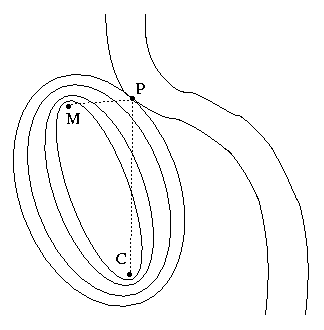

显然，$f(\vec{P})$ 的等值线与河边曲线的交点 $\vec{P}$ 即为我们想求的点。

这样的点满足什么性质呢？如果没有性质也就无法列出关系式进行求解，但是这么特殊的点极有可能存在良好的某种特性。

最直观的性质：等值线（椭圆）在 $\vec{P}$ 点的法向量 $\vec{n}$ 与河边曲线的法向量 $\vec{m}$ 平行，即：
$$
\vec{n} = \lambda \vec{m}
$$
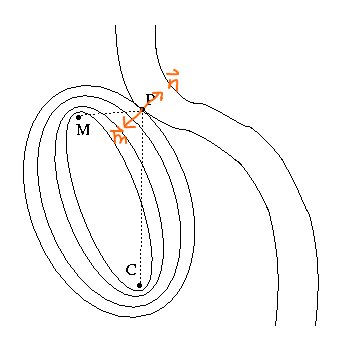

在多元微积分中，一个函数 $h$ 在某一点 $\vec{P}$ 的梯度是点 $\vec{P}$ 所在等值线（2D）或等值面（3D）的法向量，即 $\vec{n} = \nabla{h(\vec{P})}$ ，所以对于函数 $f, g$ ：
$$
\vec{n} = \lambda \vec{m} 
\Rightarrow \nabla{f(\vec{P})} = \lambda \nabla{g(\vec{P})} 
\Rightarrow \binom{f_x}{f_y} = \lambda \binom{g_x}{g_y} 
\Rightarrow 
\begin{cases}
f_x = \lambda g_x \\
f_y = \lambda g_y
\end{cases}
$$
即由相交点的性质我们得到两个关系式（对于 3D 则可以得到三个关系式，以此类推），再加上约束条件：
$$
g(\vec{P}) = g(x, y) = 0
$$
一共三个关系式，由线性代数知识可知三个关系式，三个未知量 $(x, y, \lambda)$ 极有可能有唯一解，当然也不排除会出现多个解甚至无穷多解。如下图河边是一条直线，且 $\vec{M}, \vec{C}$ 就在河边时：

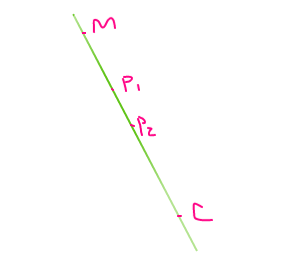

### 从数学公式中获得灵感

仍然是问题：
$$
\begin{array}
\text{minimize} & f(\vec{P}) = d(\vec{M}, \vec{P}) + d(\vec{P}, \vec{C}) \\
\text{subject to} & g(\vec{P}) = 0
\end{array}
$$

我们知道在多元微积分中，如果想求一个函数的极值，一般的做饭是把 $\nabla{f(\vec{P})} = 0$ ，如何把这个公式和我们的约束条件 $\nabla{g(\vec{P})} = 0$ 统一在一起呢？答案是：引入 $\lambda$ 并且定义一个新的函数：
$$
\pmb{F}(\vec{P}, \lambda) = f(\vec{P}) - \lambda g(\vec{P})
$$
令：
$$
\nabla{\pmb{F}(\vec{P}, \lambda)} = \nabla{\pmb{F}(x,y,\lambda)} = 
\begin{pmatrix} \pmb{F}_x \\ \pmb{F}_y \\ \pmb{F}_{\lambda}\end{pmatrix} = 0
$$
上式与我们要求解的优化问题是等价的，因为 $\pmb{F}_{\lambda} = g(\vec{P}) = g(x, y) = 0$ 与约束条件等价，而且此时 $\pmb{F}(\vec{P}, \lambda) = f(\vec{P}) - \lambda 0 = f(\vec{P})$ 即拉格朗日函数 $\pmb{F}(\vec{P})$ 与我们的目标函数 $f(\vec{P})$ 取相同值。用拉格朗日函数把目标函数和约束条件统一在一起。实际上这种方法与上面的几何方法是完全等价的：
$$
\begin{align}
& \pmb{F}_x = 0 \Rightarrow f_x - \lambda g_x = 0 \Rightarrow f_x = \lambda g_x \\
& \pmb{F}_y = 0 \Rightarrow f_y - \lambda g_y = 0 \Rightarrow f_y = \lambda g_y \\
& g(x, y) = 0
\end{align}
$$

### 推广到高维空间

以上我们一直在讨论 二维的情形，下面让我们看看这个问题的高维情况，以几何观点为例，假设约束条件变成：
$$
g(\vec{P}) = 0 \\
h(\vec{P}) = 0
$$
其中 $h$ 是紫色椭圆球面，$g$ 是平面。它们相交于黑色的环，且在相交线上（黑色环）各自的方向向量 $(\vec{n}_h, \vec{n}_g)$ 与相交线垂直。

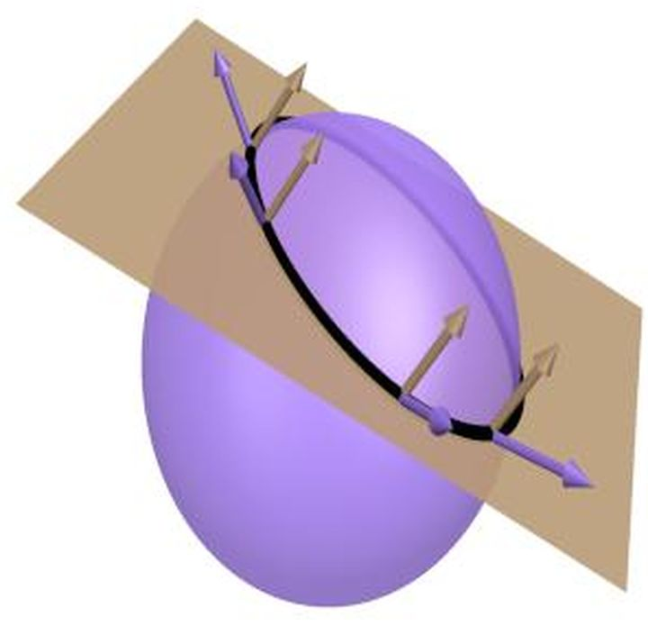

对于我们的目标函数 $f(\vec{P})$ ，下图中红色椭球是它的等值面。它与黑色环的交点 $\vec{P}$ ，此处的向量为：
$$
\vec{n}_f = \lambda \vec{n}_h + \mu \vec{n}_g \Rightarrow \nabla{f(\vec{P})} = \lambda \nabla{h(\vec{P})} + \mu \nabla g(\vec{P})
$$
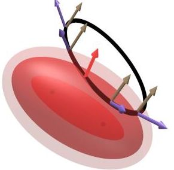

# 
离散化的基本方法

## 有限差分

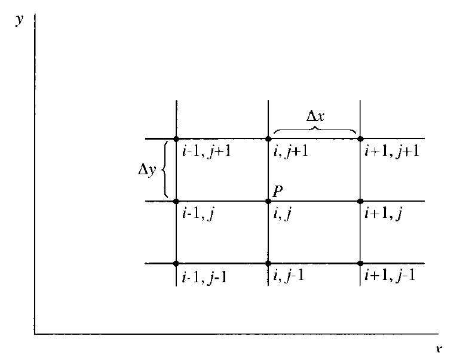

离散网格点

网格沿 $x$ 方向用 $i$ 标记，沿 $y$ 方向用 $j$ 标记。如果 $P$ 点的标号是 $(i, j)$ ，那么 $P$ 点 右边的网格点就是 $(i+1, j)$，左边是 $(i-1, j)$ ，上边是 $(i, j+1)$ ，下边是 $(i, j-1)$ 。

### 一阶导数一阶前向差分

用 $u_{i, j}$ 表示速度 $x$ 分量在 $(i ,j)$ 点的值，则 $(i+1, j)$ 点的速度分量 $u_{i+1, j}$ 可以用点的泰勒展开表示：
$$
u_{i+1, j} = u_{i, j} + \left( \frac{\partial{u}}{\partial{x}} \right)_{i, j} \Delta{x} + \left( \frac{\partial^2{u}}{\partial{x^2}} \right)_{i, j} \frac{(\Delta{x})^2}{2} + \left( \frac{\partial^3{u}}{\partial{x}^3} \right)_{i, j} \frac{(\Delta{x})^3}{6} + \cdots
$$
由上式移项整理可得：
$$
\left( \frac{\partial{u}}{\partial{x}}\right)_{i, j} = \frac{u_{i+1, j} - u_{i, j}}{\Delta{x}} + O(\Delta{x})
$$
由上式可以看出，导数的有限差分表达式实际上是一个分式，即相邻网格点上函数值的差与自变量的差之比。所以严格的术语应该是差商。其中 $O(\Delta{x})$ 是数学上表示“与$\Delta{x}$ 同阶的项”的一种记法。截断误差的最低阶项是 $\Delta{x}$ 的一次方项，所以称上述有限差分具有一阶精度。
$$
\left( \frac{\partial{u}}{\partial{x}}\right)_{i, j} \approx \frac{u_{i+1, j} - u_{i, j}}{\Delta{x}}
$$
上述有限差分只用到 $(i, j)$ 点右边的信息，所以叫前向差分。

### 一阶导数一阶后向差分

再看看在 $u_{i-1, j}$ 处的泰勒展开：
$$
u_{i-1, j} = u_{i, j} - \left( \frac{\partial{u}}{\partial{x}} \right)_{i, j} \Delta{x} + \left( \frac{\partial^2{u}}{\partial{x}}\right) \frac{(\Delta{x})^2}{2} - \left( \frac{\partial^3{u}}{\partial{x}^3} \right)_{i, j} \frac{(\Delta{x})^3}{6} + \cdots
$$
上式移项整理可得：
$$
\left( \frac{\partial{u}}{\partial{x}} \right)_{i, j} = \frac{u_{i,j - u_{i-1, j}}}{\Delta{x}} + O(\Delta{x})
$$
上述有限差分只用到了点 $(i, j)$ 左边的信息，即，除了 $u_{i, j}$ 外还用到了 $u_{i-1, j}$ ，$(i, j)$ 点右边的信息没有用到，因此该差分称为后向差分。因为截断误差的最低阶项是 $\Delta{x}$ 也是一次方项，所以称为一阶向后差分。

### 一阶导数二阶中心差分

在 CFD 中，一阶精度是不够的，所以要构造二阶精度的有限差分，直接式 (23) 减式 (20)，得：
$$
u_{i+1, j} - u_{i-1, j} = 2 \left( \frac{\partial{u}}{\partial{x}} \right)_{i,j} \Delta{x} + 2 \left( \frac{\partial^3{u}}{\partial{x}^3} \right)_{i,j} \frac{(\Delta{x})^3}{6} + \cdots
$$
上式整理可得：
$$
\left( \frac{\partial{u}}{\partial{x}}\right)_{i,j} = \frac{u_{i+1,j} - u_{i-1, j}}{2\Delta{x}} + O(\Delta{x})^2
$$
从上式看到，有限差分的信息来自点 $(i, j)$ 的左右两边，即 $u_{i+1,j}$ 和 $u_{i-1,j}$ 。点 $(i, j)$ 落在他们中间，同时，上式的截断误差最低阶项是 $(\Delta{x})^2$ ，即具有二阶精度，所以上式有限差分称为二阶中心差分。

### 二阶导数二阶中心差分

有时候有些场景会出现二阶导数的情况，例如后面要讲的纳维-斯托克斯方程中就会出现二阶偏导数，所以 CFD 中需要对二阶导数进行离散。继续利用泰勒展开，就可以得到二阶导数的有限差分表达式。将式 (53) 和式 (56) 相加，可得：
$$
u_{i+1, j} + u_{i-1, j} = 2u_{i, j} + \left(\frac{\partial^2{u}}{\partial{x}^2} \right)_{i,j} (\Delta{x})^2 + \left( \frac{\partial^4{u}}{\partial{x}^4} \right)_{i,j} \frac{(\Delta{x})^4}{12} + \cdots
$$
从上式解得：
$$
\left( \frac{\partial^2{u}}{\partial{x}^2}\right)_{i,j} = \frac{u_{i+1,j} - 2u_{i,j} + u_{i-1,j}}{(\Delta{x})^2} + O(\Delta{x})^2
$$
这就是二阶导数的二阶中心差分。

### 总结

有限差分还有好多，这里不逐个推导了，下面简单列举一下用到的有限差分公式：

|              名称              |                             公式                             |                             图释                             |
| :----------------------------: | :----------------------------------------------------------: | :----------------------------------------------------------: |
| $x$ 方向一阶导数的一阶前向差分 | $\left(\frac{\partial{u}}{\partial{x}}\right)_{i,j} = \frac{u_{i+1,j} - u_{i,j}}{\Delta{x}}$ | 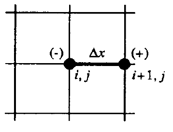 |
| $x$ 方向一阶导数的一阶后向差分 | $\left(\frac{\partial{u}}{\partial{x}}\right)_{i,j} = \frac{u_{i,j} - u_{i-1,j}}{\Delta{x}}$ |  |
| $x$ 方向一阶导数的二阶中心差分 | $\left(\frac{\partial{u}}{\partial{x}}\right)_{i,j} = \frac{u_{i+1,j} - u_{i-1,j}}{2\Delta{x}}$ | 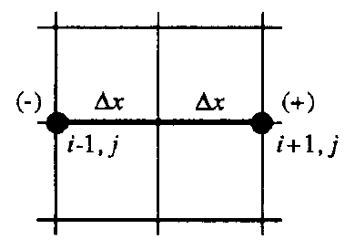 |
| $x$ 方向二阶导数的二阶中心差分 | $\left(\frac{\partial^2{u}}{\partial{x}^2}\right)_{i,j} = \frac{u_{i+1,j} - 2u_{i,j} + u_{i-1,j}}{2\Delta{x}}$ | 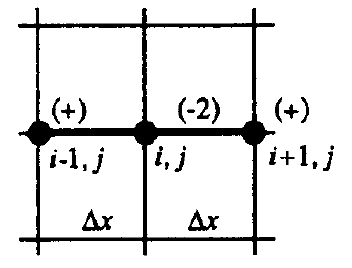 |
| $y$ 方向一阶导数的一阶前向差分 | $\left(\frac{\partial{u}}{\partial{y}}\right)_{i,j} = \frac{u_{i,j+1} - u_{i,j}}{\Delta{y}}$ | 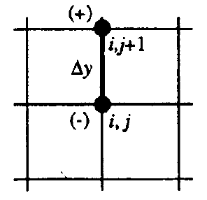 |
| $y$ 方向一阶导数的一阶后向差分 | $\left(\frac{\partial{u}}{\partial{y}}\right)_{i,j} = \frac{u_{i,j} - u_{i,j-1}}{\Delta{y}}$ | 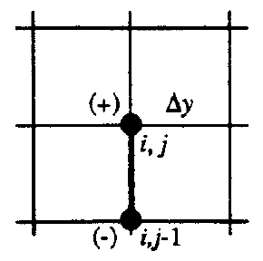 |
| $y$ 方向一阶导数的二阶中心差分 | $\left(\frac{\partial{u}}{\partial{y}}\right)_{i,j} = \frac{u_{i,j+1} - u_{i,j-1}}{2\Delta{y}}$ | 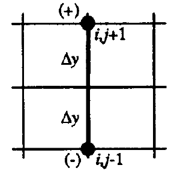 |
| $y$ 方向二阶导数的二阶中心差分 | $\left(\frac{\partial^2{u}}{\partial{y}^2}\right)_{i,j} = \frac{u_{i,j+1} - 2u_{i,j} + u_{i,j-1}}{2\Delta{y}}$ | 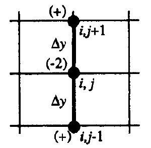 |
|   二阶混合导数的二阶中心差分   | $\left(\frac{\partial^2{u}}{\partial{x}\partial{y}}\right) = \frac{u_{i+1,j+1} + u_{i-1,j-1} - u_{i-1,j+1} - u_{i+1,j-1}}{4\Delta{x}\Delta{y}}$ | 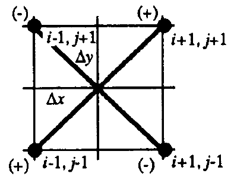 |

## 差分方程

前面用代数有限差分来表示偏导数。偏微分方程中包含了许多偏导数项。对一个给定的偏微分方程，如果将其中所有的偏导数都用有限差分来代替，所得到的的代数方程叫差分方程。如一维热传导方程：
$$
\frac{\partial{T}}{\partial{t}} = \alpha \frac{\partial^2{T}}{\partial{x}^2}
$$

# 
流体力学

## 重力

## 压强

## 粘滞力

## 密度约束

## Navier-Stokes 方程

# 
基于物理的动画框架

## 选择模型

## 模拟状态

## 力和移动

## 时间积分

## 约束和碰撞

# 
拉格朗日法  (Particle-Based Simulation)

## 领域搜索

#### 简单链表

#### 空间哈希

#### KD-Tree

## 基于力求解 

### Smooth Particle Hydrodynamics (SPH)

SPH，全称为Smoothed Particle Hydrodynamics，最初提出于天体物理学领域，然后被广泛的应用到计算流体力学领域，成为基于拉格朗日粒子模拟方法的典型代表。实际上，目前除了流体，还有刚体、软体等的物理模拟也有不少采用了SPH的方法。SPH是一种基于光滑粒子核的物理模型，它将模拟的对象离散成一个个粒子，然后以光滑核将粒子之间联系起来，显然这是一种基于拉格朗日视角的模拟方法，相对于欧拉视角的模拟方法，它比较简单、速度较快。

SPH 本质上是一种核密度估计（Kernel Density Estimation，KDE）。把空间中的物理量用它周围一个范围内的相同物理量通过逼近Delta 函数的核函数来进行插值。

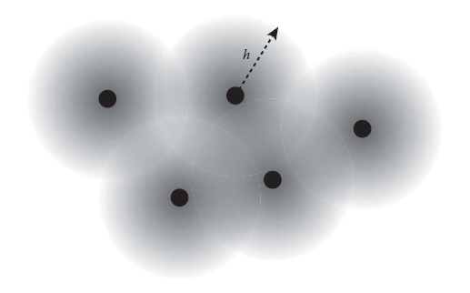

每个粒子有其音响半径 h，并且赋予任意值给粒子用于和周边模糊混合

#### 核函数（Kernel）

SPH中的平滑性是通过一个叫核函数（$W(|\vec{r}|, h)$，其中 $\vec{r}$ 表示两粒子距离，$h$ 表示核半径）的来描述。给定一个粒子位置，核函数计算任何存储在附近的粒子的值。从粒子的中心开始，随着距离越来越接近核半径，该函数值逐渐趋向于 0。对于高精度模拟，使用较多的粒子，核半径一般设置得很小。对于粗略的模拟，则会使用较少的粒子，设置较大的核半径。

如下图是一个核函数图：

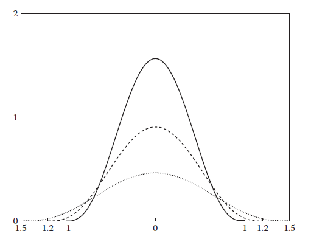

核函数在不同的半径 -1.0，1.2 和 1.5 的值。随着半径越大，函数值越小

平滑核的选择对于模拟的速度、稳定性以及质量影响都非常之大。对于这一点，Müller 等人 [Muller2003] 提供了一套非常有效的平滑核，分别用于不同的物理量的计算，他们的方法也被目前大部分关于 SPH 的工作沿用。

有效核函数的一个性质就是其积分为1，表示其权重之和是1。如果要设计自己的核函数，也需要遵循这个性质。
$$
\int W(\vec{r}) = 1
$$
#### 插值 (Interpolation)

SPH 插值的基本思想是在搜索给定位置粒子的附近粒子的物理量来插值得到指定位置粒子的物理量。这是一个权重均值，权重是质量乘以核函数值再除以相邻的粒子密度。如下公式：
$$
\Phi(\vec{p}) = m \sum_j \frac{\Phi_j}{\rho_j} W(\vec{p}_i - \vec{p}_j)
$$
上式中，其中 $\Phi$ 表示需要插值求的物理量，$\vec{p}$ 表示需要插值的位置，$m$ 表示质量，$\rho$ 表示密度，$W(|\vec{r}|)$ 表示核函数，下标 $j$ 表示附近第 $j$ 个粒子。

#### 密度 (Density)

密度是一个每个时间步长里随着粒子位置变化而变化的物理量。因此我们需要根据更新的位置来计算密度，该密度值会用来参与其他 SPH 操作。例如之前提到的插值函数就依赖该密度值。因此我们需要优先计算该密度值，然后该密度值被用于计算梯度值、拉普拉斯算子。而要获得密度，可以用上述的插值来计算得到。而要用插值就需要先得到密度，这样一来，就进入了死循环了。如果我们把 $\Phi_j$ 用 $\rho_j$ 代替，那么，上述插值公式就可以简化成如下所示，这样子密度值就被消除了，解决了死循环的问题。
$$
\rho(\vec{p}) = m \sum_j W(\vec{p} - \vec{p}_j)
$$
#### 核函数的选择

一个标准的核函数，Poly6 核函数：
$$
W_{poly6}(|\vec{r}|, h) = 
\begin{cases}
\frac{315}{64\pi h^9} (h^2 - |\vec{r}|^2)^3 \quad & 0 \le |\vec{r}| \le h \\
0 \quad & otherwise
\end{cases}
$$
化简为：
$$
W_{poly6}(|\vec{r}|, h) = 
\begin{cases} 
\frac{315}{64\pi h^3} (1-\frac{|\vec{r}|^3}{h^2})^3 \quad \quad & 0 \le |\vec{r}| \le h \\ 
0 \quad \quad & otherwise
\end{cases}
$$

Poly6 核的梯度 (Gradient) ：
$$
\nabla{W_{poly6}(|\vec{r}|, h)} = 
\begin{cases}
-\frac{945}{32\pi h^5} (1 - \frac{|\vec{r}|^2}{h^2})^2 \quad & 0 \le |r| \le h \\
0 \quad & otherwise
\end{cases}
$$
Poly6 核的拉普拉斯算子 (Laplacian) ：
$$
\nabla^2{W_{poly6}(|\vec{r}|, h)} = 
\begin{cases}
\frac{945}{32\pi h^5} (1 - \frac{|\vec{r}|^2}{h^2})(\frac{3|\vec{r}|^2}{h^2} - 1) \quad & 0 \le |\vec{r}| \le h \\
0 \quad & otherwise
\end{cases}
$$
Poly6 和 Spiky 的源函数、梯度、拉普拉斯算子图：

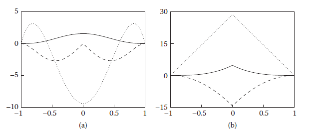

Poly6 和 Spiky 的比较，其中实线是原函数，短虚线是梯度，点虚线是拉普拉斯函数

上图左边是 poly6 函数，右边是 spiky。 由上图可以看出 Poly6 核的梯度在中心变为 0，我们需要计算流体的压力梯度来确保立体的不可压缩性，如果直接采用 poly6 的梯度来计算压力的梯度力，那么当两个粒子重合时，其压力梯度力为零，不存在一个力使它们分开，从而违背了流体的不可压缩性。拉普拉斯算子的计算也存在同样的问题，，而流体的粘滞力计算将用到拉普拉斯算子。因此 poly6 的梯度它不适用于插值压力和粘滞力，为了使粒子接近时具有较大的压力，必须使用另一种梯度在 0 点有较大取值的平滑核来插值压力，称为 Spiky 核。

Spiky 核函数：
$$
W_{spiky}(|\vec{r}|, h) = 
\begin{cases}
\frac{15}{\pi h^6} (h - |\vec{r}|)^3 \quad & 0 \le |\vec{r}| \le h \\
0 \quad & otherwise
\end{cases}
$$
化简为：
$$
W_{spiky}(|\vec{r}|, h) = 
\begin{cases}
\frac{15}{\pi h^3} (1 - \frac{|\vec{r}|}{h})^3 \quad & 0 \le |\vec{r}| \le h \\
0 \quad & otherwise
\end{cases}
$$
Spiky 核的梯度：
$$
\nabla{W_{spiky}(|\vec{r}|, h)} =
\begin{cases}
- \frac{45}{\pi h^4} (1 - \frac{|\vec{r}|}{h})^2 \quad & 0 \le |\vec{r}| \le h \\
0 \quad & otherwise
\end{cases}
$$
Spiky 核的拉普拉斯算子：
$$
\nabla^2{W_{spiky}(|\vec{r}|, h)} =
\begin{cases}
\frac{90}{\pi h^5} (1 - \frac{|\vec{r}|}{h}) \quad & 0 \le |\vec{r}| \le h
\\
0 \quad & otherwise
\end{cases}
$$
抽象一下梯度函数：
$$
\nabla{\Phi(\vec{x})} = m \sum_{j} \frac{\Phi_j}{\rho_j} \nabla W(|\vec{x} - \vec{x_j}|)
$$
这里面的核在计算梯度的时候存在一个问题，就是不对称，我们通常需要计算梯度向量来获取粒子之间相互作用力，根据牛顿第三定律，力时相互作用的，因而时对称的，但是上述公式计算得到的向量并不是对称的。为了解决这个问题，有不同版本的梯度实现，一个比较常见的实现如下：
$$
\nabla \Phi = \rho_i m \sum_j \left(\frac{\Phi_i}{\rho_i^2} + \frac{\Phi_j}{\rho_j^2} \right) \nabla W(|\vec{x} - \vec{x}_j|)
$$
上面算法存在一个问题，对于常量的场，它的返回值不为零，甚至 $\Phi$ 表示的物理量的所有值均不为零的相同常数时，返回值也不为零。这是一个大问题。因为我们要用 Laplacian 算子计算粘滞力 (viscosity force)。其实，通过减去原粒子的物理量可以解决这个问题。公式如下：
$$
\nabla^2{\Phi(\vec{x})} = m \sum_j \left( \frac{\Phi_j - \Phi_i}{\rho_j} \right) \nabla^2{W(\vec{x} - \vec{x}_j)}
$$
#### 动力学 (Dynamics)

根据 Navier-Stokes 方程的动量方程，每个粒子的加速度为：
$$
\vec{a} = -\frac{\nabla{\vec{p}}}{\rho} + \mu \nabla^2{\vec{v}} + \vec{g}
$$
上述公式右边分别是流体的 压力项 $-\frac{\nabla{\vec{p}}}{\rho}$ 、粘滞力项 $\mu \nabla^2{\vec{v}}$ 以及体积力 $\vec{g}$ （这里目前只有重力）。在模拟过程中，我们需要分别计算这几项。一个完整的 SPH 求解器计算流程如下所示：

1. 计算所有粒子当前位置的密度
2. 基于密度计算流体压强
3. 计算压强的梯度力
4. 计算流体的粘滞力
5. 计算重力和其他外力
6. 按照时间片做积分

**计算粒子的密度**
$$
\rho_i(\vec{p}) = m_i \sum_{j} W(\vec{p}_i - \vec{p}_j)
$$
**计算流体的压强**

流体的压强是流体内部的一种力，它是维持流体不可压缩的关键。目前我们只知道流体的密度值，流体的密度与压强存在很强的联系，密度越大，压强也越大，因此需要根据流体的密度计算其对应的压强值。当然，我们可以直接求解关于流体的泊松方程 $\nabla^2 \vec{P} = \rho \frac{\nabla{\vec{v}}}{\Delta{t}}$ ，这样求解得到的压强是非常精确的，直接求解泊松方程在基于欧拉网格的流体模拟中比较常见，但是求解大规模稀疏矩阵的泊松方程非常耗时，因此在基于拉格朗日粒子的流体模拟中比较少（但也有），一种非常廉价且效果非常不错的方法就是采用泰特的状态方程（Equation of State）：
$$
\vec{p} = \frac{k}{\gamma} \left( \frac{\rho}{\rho_0} - 1 \right)^\gamma
$$
这里的 $\vec{p}$ 表示压强，$k$ 是状态方程的缩放因子，$\gamma$ 是状态方程指数，一般取值为7，$\rho$ 是流体当前密度，$\rho_0$ 是设定的流体初始密度。其中 $k$ 的计算如下：
$$
k = \rho_0 \frac{c_s}{\gamma}
$$
$c_s$ 表示该流体中的声速。通过这个状态方程，我们可以计算出流体的压强值。但是存在一个问题，我们是通过领域粒子来计算的，这意味着在接近水平面时，流体表面的粒子因为领域粒子较少使得其计算出来的密度值 $\rho$ 低于初始密度 $\rho_0$，进而返回值为负数，如下图所示。从而导致流体在表面上的不正常聚集现象，这种现象类似于表面张力，但是它病不是物理意义上准确的，所以我们需要消除这种现象。解决方法是当返回值小于 0 时，做一个 clamp 到正值。

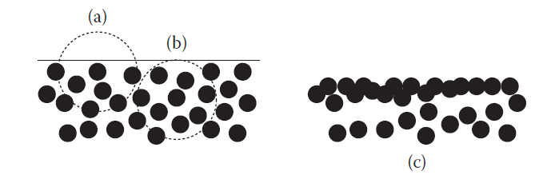

表面的低密度导致的负压强使粒子不正常地聚集

**计算压强的梯度力**

前面一步我们得到了流体粒子压强，在压强的作用下，流体粒子从高压强区域流向低压强区域，是流体保持不可压缩的性质。因此，我们需要计算作用在流体粒子上的压强梯度力。压强梯度力计算公式为：
$$
\vec{f}_p = -m \frac{\nabla{\vec{p}}}{\rho}
$$
梯度可以使用之前的对称核求解：
$$
\vec{f}_p = -m^2 \sum_j \left( \frac{p_i}{\rho_i^2} + \frac{p_j}{\rho_j^2} \right) \nabla{W(|\vec{x} - \vec{x}_j|)}
$$
**计算流体粘滞力**

流体的粘滞力是流体内部的一种阻力，粘滞力的计算需要计算流体速度场的拉普拉斯算子，这是因为拉普拉斯算子衡量了给定位置的物理量与周围领域物理量的差距值：
$$
\vec{f}_v = m \mu \nabla^2{\vec{v}}
$$
在 SPH 的算法中，其同样是通过光滑核函数计算粘滞力，注意这里为了避免常量函数的拉普拉斯算子为非零，采用了前面的公式：
$$
\vec{f}_v(\vec{x}) = m^2 \mu \sum_j \left( \frac{\vec{v}_j - \vec{v}_i}{\rho_j} \right) \nabla^2 W(\vec{x} - \vec{x}_j)
$$
**计算重力和其他外力**

这里外部的作用力通常是体积力，即间接地作用在流体上而非通过直接接触产生的作用力。常见的体积力有重力和风力，这些体积力我们直接根据需要指定其加速度的值，然后采用牛顿定律叠加到粒子的力场上
$$
\begin{align}
\vec{f}_{g} &= m \vec{g} \\
f_{ext} &= f_{g} + f_{w}
\end{align}
$$
**时间片积分**

前面计算得到每个流体粒子的作用力合力，接着需要根据这个力计算粒子的加速度，然后在加速度的作用下更新粒子的速度值，最后在速度的作用下计算粒子的位置向量。这个步骤只需要简单的利用牛顿定律即可。
$$
\begin{align}
\vec{f} &= \vec{f}_p + \vec{f}_v + \vec{f}_{ext} \\
\vec{v} &= \vec{v}_0 + \Delta{t} \frac{\vec{f}}{m}
\end{align}
$$
#### 自适应时间步长

这里还有个非常关键的点，就是模拟的时间步长选取。为了使得流体的密度守恒（即保持不可压缩性），我们采用了泰特的状态方程，该方程引入了两个参数，分别是指数 $\gamma$ 和声波在流体中的传播速度，这带来了一些时间步长的限制问题。如下图所示，假设一个流体粒子从空中落到一滩流体中，这个过程会产生一些震荡波，白色的粒子是落下的粒子以及获取到了震荡波信息的粒子。

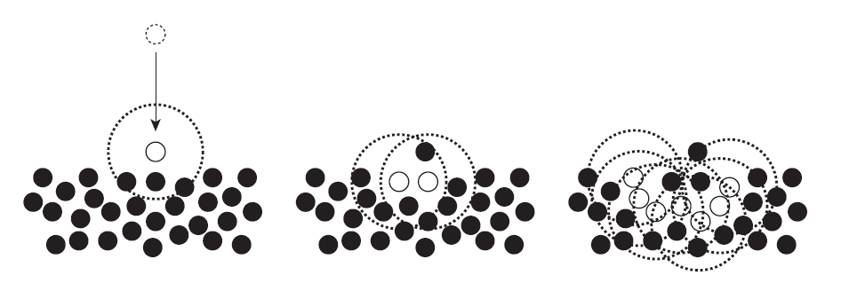

流体粒子的信息传播

受限于有限的光滑核半径，在每一个时间步长内，信息传播的范围最大为光滑核半径的长度。设信息的传播速度为 $c$ ，那么我们能取得最大时间步长就是 $h/c$ 。在我们的物理模拟中，这个信息传播速度实际上就是声波在流体中的传播速度。为此，研究者们提出自适应的时间步长，根据当前的流体状态计算最大的时间步长，如果取超过这个最大时间步长受限制，那么将会导致流体崩溃，产生不稳定问题。时间步长的上界计算公式为：
$$
\begin{align}
\Delta{t_v} &= \frac{\lambda_v h}{c_s} \\
\Delta{t_f} &= \lambda_f \sqrt{\frac{mh}{F_{max}}} \\
\Delta{t} & \le min(\Delta{t_v}, \Delta{t_f})
\end{align}
$$
其中，$h$ 是光滑核半径，$m$ 是粒子质量，$c_s$ 是声波在流体中的传播速度，$F_{max}$ 是流体粒子当中受到的最大合理的长度值，$\lambda_v$ 和 $\lambda_f$ 是一个缩放系数，分别取 0.4 和 0.25。可以看到，时间步长的上界不仅仅取决于声波的传播速度，还取决于每一个不同的时刻流体所受的最大合力，因而每一次模拟都要重新计算下一个时间步长。

真实世界中的声波在流体中的传播速度很快的，这导致上述公式计算得到的时间步长是非常小的。举个例子，假设我们的光滑喝半斤为 0.1 m，质量为 0.01 kg，声波传播速度为 1482 $m/s$，在只有重力这个外力的作用下，根据公式计算可得 $\Delta{t_v} = 0.00002699055331 s$，而 $\Delta{t_f} = 0.0007985957062$，因此最大的时间步长为 0.00002699055331 ，这意味着如果模拟 60 帧率的话，那么一秒需要计算 618 个子时间步长，耗费大量的时间和计算资源，即便是离线模拟，其代价也太大了。这个就是传统 SPH 算法的缺点，被称为 WCSPH（Weakly Compressible SPH），针对这个缺点，目前已近有不少研究者提出了不同的改进方法，其中比较优秀的算法就是 PCISPH。

#### 碰撞检测处理

这里碰撞分为两类，一类是粒子与粒子间的碰撞，对于这种碰撞，使用 SPH 或者 PCISPH 即可。另一类是粒子与其他场景物体的碰撞，例如地板、容器、甚至移动的角色。

一个被流体部分碰撞的固体叫做碰撞体。碰撞体考虑当前状态（位置和速度）和粒子属性（半径和恢复系数），然后还原到恢复的状态。下图是一个碰撞体如何处理碰撞事件的概览。

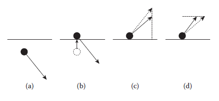

上面简单的碰撞方案：

(a) 当粒子穿透表面时 

(b) 它被推到最近的点 

(c) 法线速度在恢复系数基础上按比例缩小 

(d) 切线速度同样也根据摩擦力缩放

该流程开始于检测粒子新的位置是否穿透或者太靠近表面。如果没有穿透，那就什么都不做，直接退出。如果穿透，就是上图 (b) 的情况，我们把粒子推到表面外面。恢复系数决定反弹量。如果该系数是零，则表示没有任何反弹，也就是粒子附着在表面上。如果恢复系数设置成 1，则表示良好的弹性碰撞，粒子会用同样速度大小反弹回去。

## 基于位置求解

### Position Based Dynamics (PBD)

传统的物理模拟方法都是基于力的方法，这类方法通过计算内部李（如流体内部的粘滞力、压力等）和外部力（如重力、碰撞力、风力等）的合力，然后根据牛顿第二定律计算出加速度，最后根据数值计算方法求出物体的速度和位置。这种方法基本上针对每一种动态物体，会有一个独立的求解器，各种求解器按照一定的顺序计算，从而得到模拟的结果，这样会带来大量冗余的工作。**基于位置动力学（Position Based Dynamics）**的方法将这些物理运动通过约束表达出来，这样只需要一个求解器即可，更加方便地进行物理模拟。

下图是基于力的更新流程：

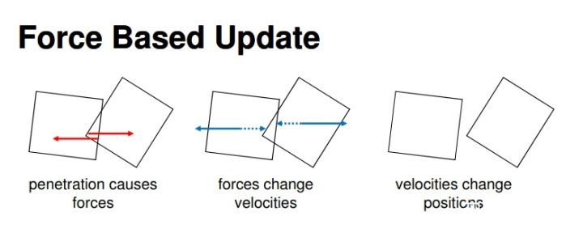

基于力的更新流程

上图在检测到碰撞之后，需要计算穿透导致的碰撞力（使两个发生穿透的物体分开），然后根据该力求解出速度和位置信息。这种方法需要计算三个步骤：力、速度、位置，才能最终更新物体位置，这样一来就有明显的反应延迟。另外一个更为明显的问题是，计算碰撞力的时候需要选择一个刚度（stiffness）参数（可以将红色箭头理解为弹簧，需要选择合适的弹性系数以产生碰撞力将物体分开）。而刚度系数很难调，刚度值太小会导致物体穿透明显，而刚度值太大则容易造成整个方程组呈现刚性，也就是说需要很小的步长才能对方程组进行准确的数值求解。（注：刚度是材料力学中的名词，定义为施力与所产生变形量的比值，表示材料或结构抵抗变形的能力。刚度系数越高，物体越不容易发生形变；刚度系数越低，物体越容易发生形变）

同样的情况，我们看看 PBD 是怎么处理的，如下图：

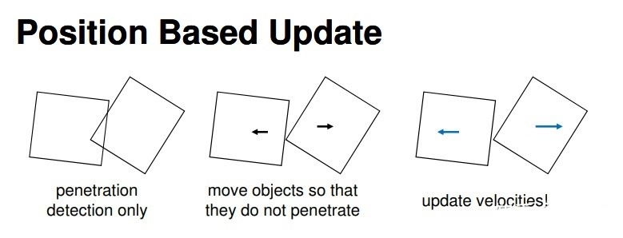

基于位置的更新流程

在 PBD 方法中，当检测到两个物体发生穿透时，直接根据约束修正物体位置，然后更新速度信息。在 PBD 中最重要的一个概念就是约束。什么是约束？用上图的例子，就是两个物体保持不互相穿透。如果两个物体互相穿透，我们就根据运行方向的反方向直接把物体分开，让它们不穿透这个过程中，我们没有求力的。

#### 算法

我们用一个 N 个顶点和 M 个约束组成的集合表示动力学物体。顶点 $i \in \left[1, \cdots , N \right] $ 的质量为 $m_i$ ，位置为 $\vec{x}_i$ ，速度为 $\vec{v}_i$ 。约束 $j \in [1, \dots, M] $ 有以下五种特性：

- 约束的基数为 $n_j$ ，可以理解为第 $j$ 个约束所影响的顶点数目为 $n_j$
- 约束的值为实数的函数 $C_j : \R^{3n_j} \rightarrow \R$ 
- 约束索引值为 $\{i_1, \dots, i_{n_j}\}, i_k \in [1, \dots, N]$
- 每个约束都有对应的刚度参数 $k_j \in [0 \dots 1]$ ，在 PBD 中，刚度参数可以理解为约束的强度，而非刚体的强度
- 约束分为等式约束 $C_j(\vec{x}_{i_1}, \dots, \vec{x}_{i_{n_j}}) = 0$  与不等式约束 $C_j(\vec{x}_{i_1}, \dots, \vec{x}_{i_{n_j}}) \ge 0$。例如，由一根棒子相连的两个小球，它们的位移约束是 $C(x_1, x_2) = \parallel \vec{x}_1 - \vec{x}_2 \parallel - l = 0$ ，这个是等式约束；又如，二维平面上描述一个点不能到 $x$ 轴负半平面，也就是它被 $y$ 轴挡住了，不能穿过去，可以用约束 $C(\vec{x}) = \vec{x} \cdot \begin{bmatrix}1 \; 0\end{bmatrix}^T \ge 0$ 来表示，其中 $\cdot$ 表示点积。

基于这数^据和时间步长 $\Delta{t}$ ，PBD 算法如下：

> 1. ​	**forall** vertices $i$
> 2. ​		initialize $\vec{x}_i = \vec{x}_i^0, \vec{v}_i = \vec{v}_i^0, w_i = 1/m_i$ 
> 3. ​	**endfor**
> 4. ​	**loop**
> 5. ​		**forall** vertices $i$ **do** $\vec{v}_i \leftarrow \vec{v}_i + \Delta{t} w_i \pmb{f}_{ext}(\vec{x_i})$
> 6. ​		dampVelocities($\vec{v_i}, \dots, \vec{v}_N$)
> 7. ​		**forall** vertices $i$ **do** $\vec{p}_i \leftarrow \vec{x}_i + \Delta{t} \vec{v}_i$
> 8. ​		**forall** vertices $i$ **do** generateCollisionConstraints($\vec{x}_i \rightarrow \vec{p}_i$)
> 9. ​		**loop** solverIterations **times**
> 10. ​			projectConstraints($C_1, \dots, C_{M+M_{coll}}, \vec{p}_1, \dots, \vec{p}_n$)
> 11. ​		**endloop**
> 12. ​		**forall** vertices $i$
> 13. ​			$\vec{v}_i \leftarrow (\vec{p}_i - \vec{x}_i) / \Delta{t}$
> 14. ​			$\vec{x}_i \leftarrow \vec{p}_i$
> 15. ​		**endfor**
> 16. ​		velocityUpdate($\vec{v}_1, \dots, \vec{v}_N$)
> 17. ​	**endloop**

算法思路：

首先，第 1-3 行，对顶点位置，速度和质量倒数等进行初始化。这里 $w_i = 1/m_i$ 设置为质量倒数，除了可以避免过多的除法操作以外，还可以处理静态物体 $w_i = 0$ （可以理解为质量无穷大）。第 4 行，我们把所有不能转换为位置约束的力（比如重力）记为 $\pmb{f}_{ext}(\vec{x}_i)$ ，并根据 $\pmb{f}_{ext}(\vec{x}_i)$ 的值进行一次数值积分预测速度 $\vec{v}_i$ 。然后第 5 行添加阻尼（damping），阻尼可以理解为物体在运动中发生能量损耗而导致速度衰减。所以可以在这里直接对速度进行衰减操作模拟阻尼。计算完速度后我们再第 7 行通过显示欧拉积分计算位置的预测值 $\vec{p}_i$ 。第 8 行主要是生成碰撞约束。物体会与周围环境发生碰撞，比如布料落在地板上，流水碰上一面墙等等。这些碰撞约束每个时间步都在发生变化。有了内部约束（比如不可压缩流体的密度约束）和外部约束（比如流体不能穿透地板）的数学公式之后，接下来，我们需要对这些约束进行迭代求解，也就是我们这里的第 9-11 行约束投影步骤，得到校正后的粒子位置。然后在第 12-15 行更新粒子位置和速度信息。最后，在第 16 行根据摩擦（friction）和恢复（restitution）系数修改速度（如下图所示）。这样，一个完整的 PBD 模拟步就完成了。

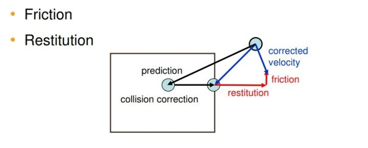

一个完整物理模拟步骤

从上述算法可以看出， PBD 在每个时间步长内的位移更新大致可以分成两步：

1. 没有化成位移约束的力的作用。如重力，虽然本质上是个保守力，与位移相关，应该是可以化为位移约束的。但是，在实际模拟中，这类约束并不健壮。因此，通常把重力这些不适合化为位移约束的力直接作为力对待，使用 force based 方法来计算这些力作用下系统下一个时刻的装填。
2. 约束投影。使用一些方法，直接调整位移，使其满足约束。可以想象成把力分为两个批次，先后对物体产生作用。显然因为现实中力的作用是同时的，所以这种近似必定会带来一定的误差。
   - 第一个批次依然是 force based 的方法：进行受力分析，计算合力、加速度、时间积分，得到速度变化量、位移变化量。这里直接使用显示欧拉法 $\vec{v}_i \leftarrow \vec{v}_i + \Delta{t} w_i \pmb{f}_{ext}(\vec{x_i})$ 来简单得到。
   - 第二个批次则是 position based 的方法，直接根据约束计算位移变化量，使变化后的位移满足约束。接下来都将讨论这一问题。

我们定义一个约束，基数 n，点集为 $\vec{p}_1, \cdots , \vec{p}_n$ ，约束函数为 $C$ ，刚性系数为 $k$。我们让 $\pmb p$ 表示 $\left[\vec{p}_1^T , \cdots , \vec{p}_n^T \right]$ 。

#### 高斯最小二乘约束法则

在讨论约束之前，我们先了解个数值分析的问题。根据**高斯最小二乘约束法则**，受约束和外力 $f_{ext}$ 的点，它的运动轨迹可以表示为：
$$
Z = \text{min} \sum_{i} m_i \parallel \ddot{\vec{p}}_i - \frac{\vec{f}_{ext}}{m_i}\parallel ^2
$$
其中 $\ddot{\vec{p}}$ 头上两个点表示位置 $\vec{p}$ 对时间 $t$ 的二阶导数，所以这里是表示加速度。其中 $\ddot{\vec{p}}_i - \frac{\vec{f}_{ext}}{m_i}$ 的物理意义是：

> 约束对加速度的改变有多大

**高斯最小二乘约束法则**的物理意义是：

> 受约束物体，它的运动轨迹是约束对加速度改变的总和的最小值

#### PBD 的物理解释

其实 PBD 这个方法研究的就是一个带约束物体的运动问题。上述高斯最小二乘法的物理意义是让约束对系统加速度改变最小。所以，我们可以利用高斯最小二乘约束法则。
#### 约束优化问题

令 $\vec{p}_i^t$ 和 $\vec{v}_i^t$ 分别表示一个质点 $i$ 在 $t$ 时刻的位置和速度，$\Delta{t}$ 是一个时间步长。那么下一时刻质点 $i$ 的位置为：
$$
\vec{p}_i^{t+\Delta{t}} = \vec{p}_i^t + \Delta{t} (\vec{v}_i^t + \Delta{t} \frac{\vec{f}_{ext}}{m_i}) + \Delta{\vec{p}_i}
$$
其中 $\Delta{\vec{p}_i}$ 就是约束对质点 $i$ 位置的修正。

此时质点 $i$ 的速度为：
$$
\vec{v}_i^{t+\Delta{t}} = \frac{\vec{p}_i^{t+\Delta{t}} - \vec{p}_i^t}{\Delta{t}} = \vec{v}_i^t + \Delta{t} \frac{\vec{f}_{ext}}{m_i} + \frac{\Delta{\vec{p}_i}}{\Delta{t}}
$$
最后，我们可以得到质点 $i$ 的加速度为：
$$
\ddot{\vec{p}_i} = \frac{\vec{v}_i^{t+\Delta{t}} - \vec{v}_i^t}{\Delta{t}} = \frac{\Delta{\vec{p}_i}}{\Delta{t}^2} + \frac{\vec{f}_{ext}}{m_i}
$$
将上面的加速度带入前面最小二乘法中，我们可以得到约束对位置的修正 $\Delta{\vec{p}}$ ：
$$
Z = \text{min} \sum_{i}m_i \parallel \ddot{\vec{p}}_i - \frac{\vec{f}_{ext}}{m_i}\parallel^2 = \text{min} \sum_{i} m_i \parallel \frac{\Delta{\vec{p}}_i}{\Delta{t}^2} \parallel^2 = \text{min} \pmb{\Delta{p}}^T \pmb{M} \pmb{\Delta{p}} = \text{min} \frac{1}{2} \pmb{\Delta{p}}^T \pmb{M} \pmb{\Delta{p}}
$$

> 由于求最小值，这里 $\Delta{t}^2$ 可以直接去掉而不会影响结果。同样的，为了后面计算方便，在目标函数前面乘以一个 $\frac{1}{2}$ 。

这个是不是有点眼熟？额，貌似还缺点什么？这个跟之前提到的最短路径有点相似啊。我们差个约束，其实上面也提到这个约束 $C$ 。当质点发生位移的时候，也需要满足约束，即：
$$
C(\pmb{p} + \pmb{\Delta{p}}) = 0
$$

把上述两式合一起成为一个数值优化的问题：
$$
\begin{array}
\text{minimize} & \frac{1}{2} \pmb{\Delta{p}}^T \pmb{M} \pmb{\Delta{p}} \\
\text{subject to} & C(\pmb{p} + \pmb{\Delta{p}}) = 0
\end{array}
$$
这是一个二次规划的问题，用前面提到的拉格朗日乘子法就可以轻松解决这个问题。按照前面提到的拉格朗日乘子法，我们构造函数 $f(\pmb{\Delta{p}})$ 和函数 $g(\pmb{\Delta{p}})$ ：
$$
\begin{align}
f(\pmb{\Delta{p}}) &= \frac{1}{2} \sum_{i} m_i \parallel \Delta{\vec{p}_i}\parallel^2 \\
g(\pmb{\Delta{p}}) &= \pmb{C}(\pmb{p} + \pmb{\Delta{p}})
\end{align}
$$

根据前述拉格朗日乘子里面提到的性质，并引入拉格朗日乘子 $\lambda \in \R^{3n_j}$ 可得：
$$
\nabla{f(\pmb{\Delta{p}})} = \lambda \nabla{g(\pmb{\Delta{p}})} \Rightarrow \pmb{M} \pmb{\Delta{p}} + \lambda \nabla{\pmb{C}} = 0
$$
进一步化简可得：
$$
\pmb{\Delta{p}} = - \lambda \pmb{M}^{-1} \nabla{\pmb{C}} 
$$
这里我们看到有两个未知数：$\pmb{\Delta{p}}$ 和 $\pmb{\lambda}$ 。所以我们还需要一个方程才能解除两个未知数来。下面我们来看下这个**约束**。

#### 约束投影

约束是个问题。不同的物体，不同的场景，我们可以设计出非常之多的约束，约束的形式也很多样，它可以是等式约束，也可以是不等式约束，它可以是线性，也可以是非线性，可以是凸函数，也可以是非凸函数。一般约束都是在仿真之前就已经确定的了。

例如：两个质点 $\vec{p}_1$ 和 $\vec{p}_2$ ，我们可以设置一个约束，它们两个之间距离必须为 $d$ 。那么这个约束就可以写成：
$$
C(\vec{p}_1, \vec{p}_2) = \parallel \vec{p}_1 - \vec{p}_2 \parallel - d = 0
$$
这个距离约束是一个标量函数，也是一个非线性约束。在 PBD 里面，一般都会把非线性转换成线性处理。那么如何转换？我们很自然想到通过泰勒展开来近似得到线性部分：
$$
\pmb{C}(\pmb{p} + \pmb{\Delta{p}}) \approx \pmb{C}(\pmb{p}) + \nabla \pmb{C}(\pmb{p}) \cdot \pmb{\Delta{p}} = 0
$$

把上式带入式 (118) 可以得到拉格朗日乘子：
$$
\lambda = \frac{C(\pmb{p})}{\nabla C(\pmb{p}) \pmb{M}^{-1} \nabla C(\pmb{p})^T} = \frac{C(\pmb{p})}{\sum_j w_j \parallel \nabla_{\vec{p}_j} C(\pmb{p})\parallel^2}
$$

把上式带入前式可得：
$$
\Delta{\vec{p}}_i = - w_i \nabla{C_{\vec{p}_i}(\pmb{p})} \frac{C(\pmb{p})}{\sum_j w_j \parallel \nabla_{\vec{p}_j} C(\pmb{p})\parallel^2}
$$
这就得出了位置修正值 $\Delta \vec{p}_i$ 。

#### 从动量守恒角度解释约束投影

这里以刚体（Rigid body）为例来说明这个约束投影的另一种解读。按照上述讨论到的，我们把非线性约束函数通过泰勒展开线性化：
$$
\pmb{C}(\pmb{p} + \pmb{\Delta{p}}) \approx \pmb{C}(\pmb{p}) + \nabla \pmb{C}(\pmb{p}) \cdot \pmb{\Delta{p}} = 0
$$
根据前面讨论的 Navier-Stokes 方程组提到的系统动量守恒，所以这里系统也是遵循动量守恒和角动量守恒。

动量守恒：
$$
\sum_i m_i \Delta \vec{p}_i = 0
$$
这里的 $m_i$ 是质点的质量。

角动量守恒：
$$
\sum_i \vec{r}_i \times m_i \Delta \vec{p}_i = 0
$$
这里的 $\vec{r}_i$ 是质点 $\vec{p}_i$ 到任意旋转中心的距离。

首先，上面两式的意思就是系统质心位置不变的意思，质心位置不变，就保证了动量守恒和角动量守恒了。为什么这样说呢？我们从动量定义出发：
$$
\vec{p} = m \vec{v}
$$
从上式可以看出，速度 $\vec{v}$ 不变的，质量不变（质量守恒），则动量是不变的。速度可以看成是当前时刻位移与上一时刻位移的差值除以时间步长，所以当前时刻位移不变的话，那速度就不变，速度不变，动量就不变。

> 这里的动量、角动量守恒是指系统的质点们的位移为 $\vec{x}$ 时具有的动量、角动量，应与位移为 $\vec{x}+\Delta{\vec{p}}$ 时具有的相同。为什么应该相同？
>
> - 这首先要考察“系统”在这里指的是什么？很容易发现，“系统”在这里指的就是所有质点的集合，那问题是“所有质点”涵盖了哪些对象？举个例子，显然地球的质心不在这个范围内，虽然我们考虑重力。
>   - 另一方面，重力也不在“第二个批次”内，也就是我们并没有用位移约束来描述重力，所以地球质心也就不在这个“系统”内。
>   - 这就导出了结论，“系统”是位移约束的对象的集合。
> - 因为“系统”是位移约束的对象的集合，所以由位移约束描述的作用力都是这个系统的内力（如果一个力的作用对象都在系统内的话，那它就是内力）。
> - 而根据动量守恒定理，角动量守恒定理，一个系统的内力是不会改变这个系统整体所具有的动量和角动量的。
> - 综上，因为 $\Delta{\vec{p}}$ 是根据位移约束得到的，是“内力”的作用结果，所以系统质点位移为 $x$ 时的动量与角动量应该与在 $\vec{x} + \Delta{\vec{p}}$ 时相同。

要动量守恒，就要找到一个方向，在这个方向上的 $\Delta \vec{p}$ 都会使得 $\Delta \vec{p}_c = 0$ ，也就是系统质心位移不变。那么这个方向是什么方向呢？PBD 会把 $\Delta \vec{p}$ 约束在梯度方向。为什么是梯度方向，而不是其他方向？为了更好理解这点，参考下图。首先，约束 $C$ 所涉及的所有粒子的位置会形成一个高维空间，下图是该空间中满足不同约束条件的粒子位置形成的等值面的 2D 示意图，黑色等值线是粒子位于该等值线上时满足约束条件 $C=0$ 。当粒子处于红色点位置的时候，不满足约束条件。如果我们沿着刚体模态方向（橙色箭头）移动，则不会改变动量，红色点依然位于红色线上，但是红色线是约束后导致动量不守恒的等值线。为了得到新位置要保持动量守恒，所以新的点位置必须要位于黑色线上。怎样让新的点位于新位置上，那么最快的修正就是朝梯度方向，也就是与刚体模态方向垂直的方向移动点，让点回到动量守恒的等值线衫，从而保证动量守恒。从图中来看，即朝 $\nabla{C}$ 方向运动去修正该约束导致的误差而引发的动量不守恒。

> rigid body modes 可以理解为无约束情况下，结构的刚体运动可以看成3个平动方向和3个转动方向的运动的合成（即平移和旋转），这些运动称为结构的刚体的模态。

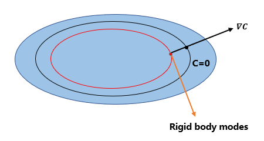

从动量守恒角度解释约束投影

因此令：
$$
\Delta \pmb{p} = \lambda \nabla_{\pmb{p}} C(\pmb{p})
$$
这里就引入了拉格朗日乘子 $\lambda$ ，让 $\Delta \pmb{p}$ 方向跟 $\nabla_{\pmb{p}} C(\pmb{p})$ 方向平行，这里 $\lambda$ 可正可负，正表示沿梯度方向修正位置，负表示沿梯度负方向修正位置。这样子就能保持动量守恒和角动量守恒。然后把上式和本节开头的泰勒展开式联立方程，解出 $\lambda$ 和 $\Delta \pmb{p}$ 。

#### 简单的例子

上述的过程有点抽象，我们看个实际例子，能够更好理解这个约束投影。继续用上面那个距离约束 $C(\vec{p}_1, \vec{p}_2) = \parallel \vec{p}_1 - \vec{p}_2\parallel^2 - d$ ，具体来看下怎么求这个 $\Delta \vec{p} $ 。

约束分别对 $\vec{p}_1$ 和 $\vec{p}_2$ 求导：
$$
\begin{align}
\nabla_{\vec{p}_1} C(\vec{p}_1, \vec{p}_2) &= \vec{n} \\
\nabla_{\vec{p}_2} C(\vec{p}_1, \vec{p}_2) &= -\vec{n} \\

\end{align}
$$
其中 
$$
\vec{n} = \frac{\vec{p}_1 - \vec{p}_2}{\parallel \vec{p}_1 - \vec{p}_2 \parallel}
$$
则 $\lambda$ 是 ：
$$
\lambda = \frac{\parallel \vec{p}_1 - \vec{p}_2 \parallel - d}{w_1 + w_2}
$$
最后的修正位置是：
$$
\begin{align}
\Delta \vec{p}_1 = -\frac{w_1}{w_1+w_2} \left(\parallel \vec{p}_1 - \vec{p}_2 \parallel - d \right) \frac{\vec{p}_1 - \vec{p}_2}{\parallel \vec{p}_1 - \vec{p}_2 \parallel} \\
\Delta \vec{p}_2 = +\frac{w_2}{w_1+w_2} \left(\parallel \vec{p}_1 - \vec{p}_2 \parallel - d \right) \frac{\vec{p}_1 - \vec{p}_2}{\parallel \vec{p}_1 - \vec{p}_2 \parallel}
\end{align}
$$

#### 求解器 (Solver)

PBD 的输入为 $M + M_{coll}$ 个约束和 $N$ 个点的预测位置 $\vec{p}_1, \dots, \vec{p}_N$ 所需要求解的方程组为非线性非对称方程组或不等式组（碰撞约束导致）。Solver 的主要任务就是修正预测位置使新得到的校正位置值满足所有约束。而在约束投影过程中，很难找到合适的 $\Delta{\pmb{p}} = \begin{bmatrix}\Delta{\vec{p}_1^T, \dots, \Delta{\vec{p}_n^T}}\end{bmatrix}^T$ 使得所有约束能够同时得到满足，所以我们通常采用迭代的方式依次对约束进行求解。

这里引入前述的迭代法方式求解方程组。前面提到雅可比和高斯赛德尔迭代法。高斯赛德尔迭代的求解的本质是：对每个约束 $C_i$ 单独的求出拉格朗日乘子，然后计算 $C_i$ 对粒子的位置修正。如果有 $m$ 个约束的话，就从第1个约束到第 $m$ 个约束依次求解。而每个第 $i $ 次约束的求解都会用到前 $i-1$ 次约束对粒子位置修正后的结果。所以高斯赛德尔本质上是串行的，不适合并行计算。如果要提高并行性，可以结合雅可比迭代的方式进行求解。就是每次分批串行，每个批次内是并行。比如说每次解10个约束，这10个约束是并行的，结完后再用这10个约束的结果作为下面10个约束的输入。

虽然雅可比迭代易于并行，但是因为雅可比时常出现不收敛的情况，为了解决这个问题，PBD 里面使用了平均雅可比迭代法，就是把解 $\Delta \vec{p}$ 除以跟粒子 $i$ 约束有关的粒子的个数 $n_i$ ，得出平均位移修正 $\Delta \vec{\tilde{p}}$ 。即：
$$
\Delta \vec{\tilde{p}}_i = \frac{1}{n_i} \Delta \vec{p}_i
$$
尽管这种局部松弛，在相邻粒子在不同约束数量的情况下无法保证动量守恒，但是误差却减少了，迭代得到收敛。

上述这种局部松弛法保证了收敛性，但是在某些情况下，该方法会以增加迭代次数为代价才达到收敛以求出解。为了解决这个问题，我们进一步引入一个叫超松弛因子（SOR）的全局参数 $\omega$ ，即：
$$
\Delta \vec{\tilde{p}}_i = \frac{\omega}{n_i} \Delta \vec{p}_i
$$
这里的 $\omega$ 在我们的所有模拟仿真中取值范围是 $1 \le \omega \le 2$ ，具体的值是根据模拟场景不同取不同的值。而低松弛 （ $\omega < 1$ ）在这里不需要。因为平均约束已经足够避免不收敛的问题。

在实践中，不同约束类型之间的处理是有优先级的。为了实现这个，我们按照约束类型分组，相同约束类型的分成一组。优先级高的约束分组先处理，先求出 $\Delta \vec{p}_i$ 并把该值累加到原位移 $\vec{p}_i$ 上，然后再处理其他优先级较低的约束分组。例如：先并行处理密度约束，然后把修正位移应用到原位移上得出新位移 $\vec{p}^*$ ，然后再并行处理接触约束。这种方式能加快约束校正也就是加快了收敛速度。

#### 碰撞约束

在算法第 8 步提到了碰撞约束。不同于普通约束在模拟过程中是固定的，碰撞约束在每个时间步长循环中都是重新生成的，即步骤 8 ，其数量也由发生碰撞的顶点决定。

先来看看检测，对于每个顶点 $i$ 其轨迹 $\vec{x}_i \rightarrow \vec{p}_i$ 进行检测，如果：

1. 射线进入到物体内部，则找到入射点 $\vec{q}_c$ 及其对应的表面法向量 $\vec{n}_c$ ，并设置一个约束 $C_i(\vec{p}_i) = (\vec{p}_i - \vec{q}_c) \cdot \vec{n}_c$ 满足先前说的不等式约束即可。
2. 射线完全处于物体内部，那么找到物体平面上最接近点 $\vec{p}_i$ 的点 $\vec{q}_s$ ，计算其法向量 $\vec{n}_s$ ，设置约束 $C_i(\vec{p}_i) = (\vec{p}_i - \vec{q}_s) \cdot \vec{n}_s$ 也满足不等约束。

这一步是在解算循环 9-11 之前完成的，这样计算效率更高，但是也意味着可能错失一些碰撞计算。

#### 阻尼

步骤 6 是计算阻尼后的速度，这里阻尼是怎么计算的呢？算法如下：

> 1.  $\vec{x}_{cm} = \left(\sum_i \vec{x}_i m_i \right) / \sum_i m_i$ 
> 2.  $\vec{v}_{cm} = \left(\sum_i \vec{v}_i m_i \right) / \sum_i m_i$ 
> 3.  $\vec{L}  = \sum_i \vec{r}_i \times (m_i \vec{v}_i)$
> 4.  $\pmb{I} = \sum_i \vec{\tilde{r}}_i \vec{\tilde{r}}_i^T m_i$ 
> 5.  $\vec{\omega} = \pmb{I}^{-1} \vec{L}$ 
> 6.  **forall** vertices $i$ 
> 7. ​		$\Delta \vec{v}_i = \vec{v}_{cm} + \vec{\omega} \times \vec{r}_i - \vec{v}_i$ 
> 8. ​		$\vec{v}_i \leftarrow \vec{v}_i + k_{damping} \Delta \vec{v}_i$ 
> 9.  **endfor**

其中 $\vec{r}_i = \vec{x}_i - \vec{x}_{cm}$ 

对照上述算法，我们先来看 6-9 ，就是对于每个质点，得到一个 $\Delta \vec{v}_i$ ，再由一个阻尼系数 $k_{damping} \in [0, \dots, 1]$ 取调节获得更新后的 $\vec{v}_i$ 。所以关键在 $\Delta \vec{v}_i$ 。步骤 7 给出 $\Delta \vec{v}_i = \vec{v}_{cm} + \vec{\omega} \times \vec{r}_i - \vec{v}_i$ ，是全局线性速度 $\vec{v}_{cm}$ 加上该点线性速度 $\vec{\omega} \times \vec{r}_i$ 构成的全局运动同当前估算速度之差，那么很显然 8 对于估算速度的修正，如果阻尼系数就是 1 ，那就是全局运动，那这个运动就是个刚体运动。

然后从头看，步骤 1 给出质心位置 $\vec{x}_{cm}$ ，步骤 2 给出 $\vec{v}_{cm}$ 是全局线速度，那 $\vec{r}_i$ 就是以质心为原点的到质点的距离向量，然后我们知道角动量 $\vec{L}$ 有：
$$
\vec{L} = \vec{r} \times \vec{p} = \vec{r} \times (m \vec{v}) = \vec{r} \times (\vec{\omega} \times (m \vec{r})) = m \parallel \vec{r} \parallel^2 \vec{\omega} = \pmb{I} \vec{\omega}
$$
其中 $\pmb{I}$ 是转动惯量，于是步骤 5 就求出角速度 $\vec{\omega}$ 。

### 统一的基于粒子的物理系统（Unified Particle Physics）

#### 并行化的逐次超松弛求解器（Parallel SOR Solver）

##### Particle Based Dynamics

##### 逐次超松弛（Successive Over-Relaxation）

##### 初始条件

##### 粒子静止（Particle Sleeping）

##### 完整算法（Algorithm）

#### 刚体（Rigid Bodies）

##### Shape Matching 约束求解器

##### 稀疏 SDF 碰撞（Sparse Signed Distance Field Collision）

##### 刚体堆叠（Stiff Stacks）

#### 流体（Fluids）

##### 密度约束求解器

$$
C_i(\vec{p}_1, \cdots, \vec{p}_n) = \frac{\rho_i}{\rho_0} - 1
$$

$$
\rho_i = \sum_j m_j W(\vec{p}_i - \vec{p}_j, h)
$$

$$
\nabla_{\vec{p}_i} C_i = \frac{1}{\rho_0} \sum_j \nabla_{\vec{p}_k} W(\vec{p}_i - \vec{p}_j, h)
$$

$$
\nabla_{\vec{p}_k} = \frac{1}{\rho_0}
\begin{cases}
\sum_j \nabla_{\vec{p}_k} W(\vec{p}_i - \vec{p}_j, h) \quad &k = i \\
- \nabla_{\vec{p}_k} W(\vec{p}_i - \vec{p}_j, h) \quad &k = j
\end{cases}
$$

$$
\lambda_i = -\frac{C_i(\vec{p}_1, \cdots, \vec{p}_n)}{\sum_k \parallel \nabla_{\vec{p}_k} C_i \parallel^2}
$$

$$
\Delta \vec{p}_i = \frac{1}{\rho_0} \sum_j (\lambda_i + \lambda_j) \nabla W(\vec{p}_i - \vec{p}_j,
$$

##### 流体固体结合（Fluid-Solid Coupling）

##### 浮力（Buoyancy）

#### 接触约束

接触约束使用于两个粒子均为其中一个为刚体的粒子的情况。
$$
\begin{align}
\Delta{\vec{x}_i} &= -\frac{w_i}{w_i + w_j} (d \cdot \vec{n}_{ij})
\\
\Delta{\vec{x}_j} &= \frac{w_j}{w_i + w_j} (d \cdot \vec{n}_{ij})
\end{align}
$$
其中 $\frac{w_i}{w_i+w_j}$ 和 $\frac{w_j}{w_i+w_j}$ 是按照质量来计算分开距离的权重。$d$ 是分开的距离，这里 $d = \parallel \vec{x}_i - \vec{x}_j \parallel - 2r$ 。$\vec{n}$ 是分开的方向向量，这里使用两粒子连线作为分离方向，即 
$$
\vec{n}_{ij} = \frac{\vec{x}_i - \vec{x}_j}{\parallel \vec{x}_i - \vec{x}_j \parallel}
$$

#### 刚体接触约束

刚体接触约束用于两个粒子均为刚体的情况。

这里我们引入 Sparse Signed Distance Field Collision （稀疏SDF）方法。

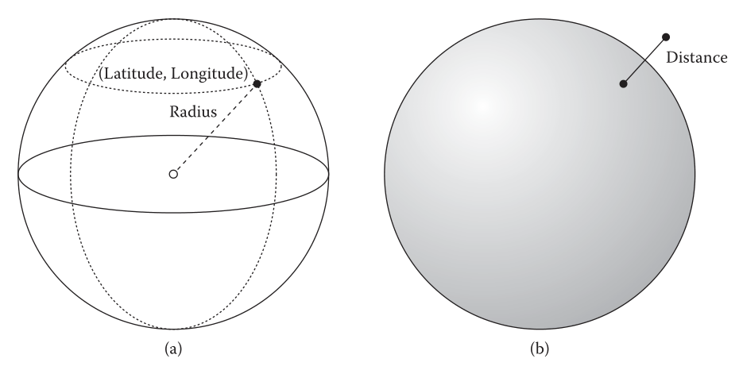

上图是两种不同表面表示方式。左图(a)是通过半径、经度和维度的传统表示表面的方式。右图(b)是通过距离场表示的表面。

传统表示球体的方式都是通过半径、经度和维度来表示。而另一种表示表面的方式是有向距离场（SDF）。什么是SDF？举个简单例子，球体函数：
$$
f(\vec{x}) = \parallel \vec{x} - \vec{c} \parallel - r
$$
这里的 $\vec{x}$ 为空间中任意一点，$\vec{c}$ 为球心，$r$ 为球半径。

当我们判断一个点是否在球面上时，当点 $\vec{x}$ 满足 $f(\vec{x}) = 0$ 的时候，则表示点 $\vec{x}$ 在表面上。当 $f(\vec{x}) < 0$ 表示该点在表面里面，就是在球体内部。当 $f(\vec{x}) > 0$ 时，则表示该点在表面外，即球体外部。这样子，我们判断是否在物体内部或者外部或者在物体表面上，则变得很简单了，直接通过判断其值小于0、大于0或者等于0即可。这就叫有向距离场（Signed Distance Field, SDF）。

SDF 有着广泛的引用。这里我们用于计算刚体接触后的运动方向。首先，我们要判断两个刚体是否接触，所以需要先进行距离判断，即：
$$
\parallel \vec{x}_i - \vec{x}_j \parallel < 2r
$$
当满足上面条件时，即表示刚体已经发生接触碰撞。这是时候需要进一步处理，避免两个刚体互相穿透嵌入。那怎么实现呢？这里引入上面提到的 SDF。

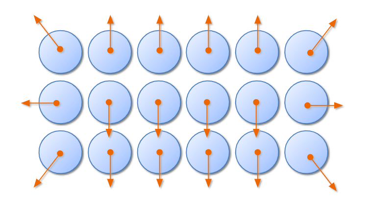

Sparse SDF

这里我们以粒子为最小单位，记录两个东西关于 SDF 的信息：SDF 距离 $\phi$ 和 SDF 的梯度 $\nabla \phi$ 。我们把这两个记录在粒子里。

接着上述问题，当两个粒子检测到发生接触时，我们需要选择一个方向，使得两个粒子能够分离。那么选择哪个方向呢？这里我们先理解一个事情。那就是这些粒子，都是物体内部的粒子，所以所有的 SDF 的 $\phi$ 值应该都是负值。那么我们选取两个粒子中距离物体外围边界最近的 $\phi$ 值的那个梯度作为分离方向。即 $d = \text{min}(|\phi_i|, |\phi_j|)$ 。
$$
\vec{n}_{ij} =
\begin{cases}
\nabla \phi_i \quad &if |\phi_i| < |\phi_j| \\
- \nabla \phi_j \quad &otherwise
\end{cases}
$$
那么每个粒子的位移为：
$$
\begin{align}
\Delta {\vec{x}_i} &= -\frac{w_i}{w_i + w_j}(d \cdot \vec{n}_{ij}) \\
\Delta {\vec{x}_j}& = \frac{w_j}{w_i + w_j}(d \cdot \vec{n}_{ij})
\end{align}
$$
这里的 $w_i = 1/m_i$ 

用下图简单描述在分别在碰撞前，碰撞时和碰撞后的三个时刻的刚体的状态：

刚体间接触约束步骤

在 $t$ 时刻两个刚体没有任何接触。在中间图经过 $\Delta t$ 时间步长后，即 $t+\Delta t$ 时刻，两个刚体发生接触，这时候就根据两个粒子中 SDF 中距离值最小的选择分离方向，即上中图中的橙色箭头，而不是蓝色箭头做分离方向。再经过一个 $\Delta t$ 时间步长后，即 $t + 2 \Delta t$ 时刻，两个物体是分离开来的。这就解决了刚体接触的问题。

然而，使用该算法仍然存在一个小问题。什么问题呢？当在接近物体表面时，由于采样不足，就会导致非连续的穿透深度和抖动。用下图说明一下这个问题。

要解决这个问题，我们把边界粒子（ $|\phi| < r$ ）跟内部粒子区别对待。当边界粒子和其他粒子发生碰撞，我们就改变接触分离法向量，并且使用 $d = \parallel \vec{x}_i - \vec{x}_j \parallel - r$ 。怎样求分离法向量？当粒子在负半空间的时候，我们可以根据 SDF 梯度方向来求得分离方向。即：
$$
\vec{n^*}_{ij} = 
\begin{cases}
\vec{x}_{ij} - 2(\vec{x}_{ij} \cdot \vec{n}_{ij}) \vec{n}_{ij} \quad &\vec{x}_{ij} \cdot \vec{n}_{ij} < 0 \\
\vec{x}_{ij} \quad &otherwise
\end{cases}
$$
下图更好说明该转变方向

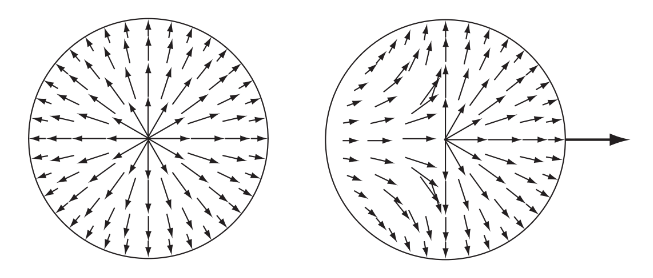

左边是普通粒子的碰撞分离法线，右边是刚体边界粒子的单向碰撞分离法线

#### 摩擦力

在处理接触的时候，我们先根据以下非穿透约束投影粒子到碰撞法线并沿距离 $d$ 上来解决穿透问题：
$$
C(\vec{x}_i, \vec{x}_j) = \parallel \vec{x}_{ij} \parallel - r \ge 0
$$
处理完互相穿透后，我们根据摩擦位移来计算当前时间步长下的相对切线位移，即：
$$
\Delta \vec{x}_{\perp} = [(\vec{x}_i^* - \vec{x}_i) - (\vec{x}_j^* - \vec{x}_j)] \perp \vec{n}
$$
这里的 $\vec{x}_i^*$ 和 $\vec{x}_j^*$ 分别是当前碰撞粒子经过前面计算加上的约束修正位移的位置。 $\vec{x}_i$ 和 $\vec{x}_j$ 分别是当前时间步长开始时的粒子位置。$\vec{n} = \vec{x}_{ij}^* / |\vec{x}_{ij}^*|$ 是接触后分离运动的方向，即接触法线。则粒子 $i$ 的摩擦位移如下计算：
$$
\Delta \vec{x}_i = \frac{w_i}{w_i + w_j}
\begin{cases}
\Delta \vec{x}_{\perp} \quad & \parallel \Delta \vec{x}_{\perp} \parallel < \mu_s d \\
\Delta \vec{x}_{\perp} \cdot \text{min} \left(\frac{\mu_k d}{\parallel \Delta \vec{x}_{\perp}\parallel}, 1 \right) \quad &otherwise
\end{cases}
$$
这里的 $\mu_k, \mu_s$ 是分别是动摩擦系数和静摩擦系数。第一个式子是当粒子的相对速度低于一定的阈值时，通过计算所有切向运动来计算静摩擦力。第二个式子通过在粒子穿透深度上限制摩擦位移来计算动摩擦力。这时粒子 $j$ 的位移变化量通过如下计算获得：
$$
\vec{x}_j = -\frac{w_j}{w_i + w_j} \Delta \vec{x}_i
$$

# 
欧拉法  (Grid-Based Simulation)

# 
拉格朗日 - 欧拉混合法

# 
基于屏幕空间的流体渲染

计算机图形学中，我们最后都要把模拟的物体渲染出来，这是图形学的最终目的。而目前对于流体渲染，无论是基于拉格朗日视角的还是基于欧拉视角的流体模拟都要经过流体表面重建这一步，然后再做进一步的光照着色计算。

流体表面重建有个非常经典的算法——Marching Cubes，该方法采用水平集（Level Set)，首先将空间划分成均匀的立方体网格，然后计算每个网格上的8个顶点的密度。对于每一个立方体，如果立方体上的一条边两个顶点的密度值大于给定的一个阈值 $\rho_{boundary}$ ，则这条边上存在着一个流体表面上的顶点。最后将每个立方体构造的多边形拼接，即可得到流体的表面网格。该方法基于这样的一个事实：流体表面处的密度应该等于某个固定的值，流体表面时一个三维密度等高面，密度值为 $\rho_{boundary}$ ，这就是水平集的思想。

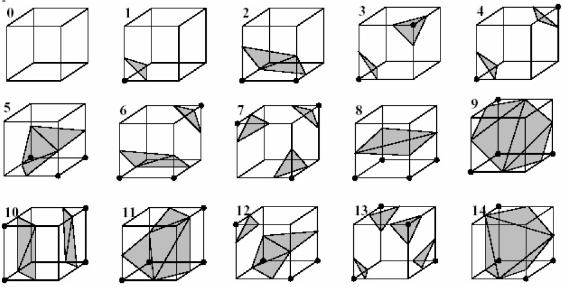

Marching Cube的15种模式

Marching Cube 是流体表面重建的传统做法，实现效果非常不错，但是算法的时间复杂度大，重建一次需要花费不少的时间。对于流动的流体来说，需要每帧构建流体表面，因而很难保证实时性。除了 Marching Cube 这类传统的流体表面重建方法，还有一些技巧性比较强的方法适合实时性应用，基于屏幕空间的流体渲染方法就是这一类。基于屏幕空间的流体渲染以一种新的思路角度展开流体的渲染，这种方法对并行友好，不涉及直接对流体表面网格的重建，实现也相对简单。

Youtube 上的一个 Marching Cube 视频：https://www.youtube.com/watch?v=B_xk71YopsA

## 基于屏幕空间渲染

## 水体的光照计算

### 深度纹理

### 厚度纹理

### 水体折射和 Bling-Phong 光照

# 体素化 Voxelization

