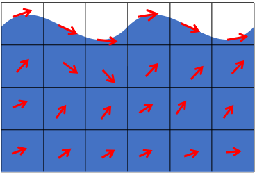
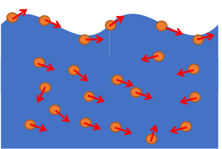
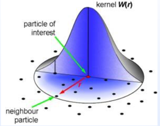
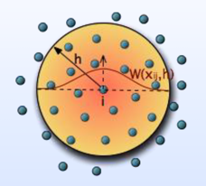

# `流体模拟入门分享`

---

[TOC]

---

# 流体基础

## 认识流体

首先，在开始研究流体之前，我们得先对它有一个初步的认识。也就是，我们得先搞懂什么是流体。

我们一般认为，流体是液体和气体等易于**流动的物质**，它是区别于固体的物质。但这个定义不太明确，什么样才是**易于流动**呢？所以，要正确理解流体和固体的区别，首先要理解**什么是流动**。流动是指**不断变形的运动**，这里变形指的是**物体的形状发生了变化**。

右边这张图就展示了一个物体在不同的力的作用下发生各种不一样的变形的情况。

物体受不同的力作用发生不一样的变形

下图是展示受力时的运动状态

流体受力时的运动状态

水装在矿泉水瓶里的时候，我们是不能判断它是液体还是固体的，当我们把它倒出来的时候，能流出来的是水，流不出来的是冰。也就是说，判断一种物质是不是流体，不是从它的成分判断的，而是根据它**受力时的运动状态**来判断。

流体受剪切力的运动状态

另外，固体可以放在桌子上保持静止，而流体就必须装在容器中才行。原因是只有装在容器中，才能使流体不受**剪切力**作用。流体的内部只要存在剪切力，就不可能处于静止状态，而是会**不断地发生变形运动**，也就是流动。

所以，我们可以给流体下一个严格的定义：**在任意小的剪切力作用下，都会发生连续不断的变形的物质**。

---

## 观察流体——两种不同的视角

在对流体有了初步的认识之后，我们就可以对流体运动进行观察和研究了。

对流体的观察，一般分为：

- **欧拉视角**。欧拉视角是指在是在固定的位置下，观察流体流过对应位置时的物理量。
- **拉格朗日视角**。拉格朗日视角是指将流体视为流动的单元，例如将一片羽毛放入风中，那么羽毛的轨迹可以帮我们指示空气的流动规律。

欧拉视角

拉格朗日视角

所以，对于欧拉视角，你可以自己是岿然不动的，你就蹲在那里，每时每刻问自己一个问题，对于我自己这个位置，经过的物质的速度是多少。而对于拉格朗日视角，你可以把自己想象成是一条随波逐流的小船，你每时每刻在问自己另外的问题，我的位置在哪里以及我现在的速度是多少，也就是说你是随着你模拟的物质一起移动。

左边是欧拉视角的模拟，右边是拉格朗日视角的模拟

这两张图中，左边就是一个典型的欧拉表示的烟雾模拟，而右边展示的是则基于拉格朗日视角的模拟，也是我们前面开场动画里的展示的基于位置的动力学的模拟，可以看到，它其实就是采用各种各样的粒子，然后通过各种方式给物体连接起来。这些粒子可以表示降落伞的绳子，这个降落伞下面栓的是个兔子，我们不仅可以用这些粒子来模拟水，还可以用它来模拟各种各样的东西。

总的来说，欧拉和拉格朗日两个视角只是从不同角度出发，研究同一个运动。

---

## 流体力学的“白月光”——NS方程

NS方程也就是**纳维-斯托克斯方程**，可以说是流体力学界的“白月光”。它在流体力学领域的地位相当于牛顿三大运动定律在经典力学里的地位。它们描述的是气体和液体在不同的环境里的运动规律，目前被广泛的用于模拟海流、飞机起飞后的湍流、以及血液流动等。

NS方程发展史上的四个重要人物

这些方程的历史可追溯到几百年前：

- 首先是欧拉建立了描述理想流体运动的微分方程，奠定了“白月光”故事的基调。
- 接着，纳维在1761年提出了流体运动的粘度理论。
- 后来，柯西在欧拉方程中引入流体微团的应力张量的概念，推导出了著名的柯西动量方程。
- 最后，结合纳维对粘度的思考和柯西的张量思维，斯托克斯便大展神威，推出了引无数流体人尽折腰的“N-S方程”。	

也就是**作为最普适的流体运动方程，它适用于可压缩变粘度的粘性流体的运动**。

三维空间中的N-S方程组的光滑解的存在性问题被美国克雷数学研究所设定为七个千禧年大奖难题之一。最近很火的北大学神韦东奕，就是在NS方程上取得了一定的突破。

这些方程描述的流体的流动就好比牛顿方程预测的行星在未来的位置一样可靠，物理学家一直在用它们对流体运动进行模拟和预测，得到的结果与实验结果相符。然而，对数学家来说，他们需要的不仅是轶事证实，还需要证明这些方程是不能被违反的：**不管起始于哪个向量场，也不管预测的是多么遥远的未来，这些方程总会且只能给你一个独一无二的新向量场**。

这就是千禧年大奖问题的主题，它探讨的问题是**NS方程是否对所有时刻的所有起点都有解**。这些解必须为流体中的每个点的流动提供精确的方向和大小。以无限精细的分辨率提供信息的解被称为**“光滑”解**。一个光滑解能让向量场中的每一个点都有与其相关的向量，使流体可以“平稳地”在场内流动，而不会陷在那些无从知道下一步该往哪移动的没有向量的点上。

光滑解是物理世界的完整写照，但从数学上讲，它们可能并不总是存在。光滑解要求的是最大化信息量，它们要求在与流体相关的向量场内， 每个点都存在一个向量。但如果我们放松这一要求，比如只需要能够计算某些点上的向量，或者只需对向量的计算进行估算呢？这样的解称为**“弱”解**。它们让数学家对一个方程的行为有个大致个把握，而不需要做找光滑解的所有工作。从某些角度来看，弱解比实际的解更容易描述，因为需要知道的信息更少。

弱解是以渐弱的状态出现的。如果将光滑解看作是一张有着无限精细的分辨率的流体数学图像，那么弱解就像是这张图片的32位、16位或8位版本，取决于你想要的微弱程度。

另外，NS方程的解对应的是真实的物理事件，而物理事件的发生是单向的。因此，方程应只有一组独一无二的解。如果你得到了好几组可能的解，那就意味着方程失效了。

这一张图展示了理想中的“光滑”解跟现实中的非唯一“弱”解的对比：

光滑解和弱解对比

- 理想中的唯一解：数学家想要证明的是，将 NS 方程应用于任何连续“光滑”的流体而得到的结果是唯一的。

- 现实中的非唯一解：弱矢量场的使用会更加容易，但它无法提供太多的细节信息。数学家发现，一些弱的描述能导致非唯一的结果——仙童的流体从完全相同的起始条件开始，会以不止一种方式流动。

另外根据不同的研究场景，NS方程还可以做一些简化，比如我们更常用的不可压缩流动。

接下来我们就讲一下简化版的NS方程，以及求它的“弱”解的一些方法。

---

## 向量微分基础

在开始介绍NS方程之前，我们温故而知新，回顾一下几个比较重要的向量微分基础知识：$\nabla$ 算子、梯度、散度、旋度和拉普拉斯算子（$\nabla^2$）。

### Nabla 算子

首先是 $\nabla$ 算子，也被称为向量微分算子，一般读作"del"，它可以直接作用于函数，得到梯度（$\nabla F$），也可以与非标量函数做点乘，得到散度（$\nabla \cdot F$），还可以与非标量函数做叉乘，得到旋度（$\nabla \times F$）。

### 梯度

接下来我们来回顾下梯度。

> 函数 $u=f(x,y,z)$ 的梯度定义为：$(\frac{\partial f}{\partial x},\frac{\partial f}{\partial y},\frac{\partial f}{\partial z})$ 所组成的一个三维向量，应用我们前面提到的$\nabla$算子，也就是相当于$\nabla f$ 。

关于梯度，有两个非常重要的性质：

- 可微函数沿梯度的方向导数最大，最大的方向导数是梯度的模。
- 梯度向量和 $f(x,y,z)$ 的等值曲面是垂直的，也就是说，我们可以通过求函数的梯度向量得到等值面的法向量。

等高线

我们记住这两个重要性质，后面我们会频繁用到这两个性质。

### 散度

下面我们来看散度的概念，散度的概念是针对于向量场而言的。

> 对于向量场 $A=(P(x,y,z),Q(x,y,z),R(x,y,z))$ ，如果分量函数 $P$、$Q$、$R$，它的偏导数存在的话，我们称 $\frac {\partial P}{\partial x}+\frac {\partial Q}{\partial y}+\frac {\partial R}{\partial z}$ 是 $A$ 在 $xyz$ 这一点的**散度**。记作：
> $$
> div A = \frac{\partial P}{\partial x} + \frac{\partial Q}{\partial y}+ \frac{\partial R}{\partial z} = \left( \frac{\partial}{\partial x} + \frac{\partial}{\partial y}+ \frac{\partial}{\partial z} \right) \cdot (P, Q, R) = \nabla \cdot A
> $$

这就是向量场散度的概念。我们可以把它形式上地写成向量点乘的形式，也就是 $\nabla \cdot A$ 。那么散度的实际意义是什么呢？

散度，它实际上是向量场在点上的通量密度。什么叫通量的密度呢？如图所示：

> 对于空间中的一点 $M$ ，我们以 $M$ 为中心，$r$ 为半径作一个球，$Σ_r$ 是球面，现在我们来求向量场通过 $Σ_r$ 的通量，也就是向量场 $A$ 沿曲面 $Σ_r$ 的曲面积分，我们用它除以 $Σ_r$ 所围成的球体的体积，就得到了**单位体积通量**。数学表达式为：
>
> $$
> \lim_{r \to 0} \frac{\iint_{\Sigma_{r}} A \cdot \mathrm{d} \pmb{S}}{V} = div A(M)
> $$
> 
>当 $r$ 趋向于 0 的时候，所对应的比值极限，就是向量场 $A$ 在 $M$ 这一点的散度，所以**散度**是向量场**通量的密度**。

如果这个向量场是个流速场的话，它表示的是在 $M$ 这一点，流体流进或流出的强弱程度。如果散度大于 0 说明在这一点，它有流体流出，它是源（source）；当小于 0 说明它有流体流入，它是汇（sink）；当散度为 0 ，那我们把这个向量场称为是无源场。

源、汇和无源场

关于散度，我们还有一个非常重要的定理，也就是大家在大学物理中学过的高斯定理：
$$
\iiint_{\pmb{V}} div \pmb{A} \mathrm{d}V = \oiint_{\pmb{S}} \pmb{A} \cdot \vec{n}\mathrm{d} \pmb{S}
$$

具体的证明我们就不证了，我们只要记住它的结论就好，简单来说，就是对于向量场在封闭曲面的面积分等于它的散度在这个曲面所围起来的体积上的体积分。这个定理非常重要，我们在后面讲到不可压缩流的时候也会用得到。

### 旋度

讲完散度的概念，下面我们来看**旋度**。**旋度**它同样也是针对向量场而言的。

> 对于向量场 $A=(P(x,y,z),Q(x,y,z),R(x,y,z))$ ，其旋度定义为：
> $$
> curl A = \left(\frac{\partial{R}}{\partial{y}}-\frac{\partial{Q}}{\partial{z}}, \frac{\partial{P}}{\partial{z}}-\frac{\partial{R}}{\partial{x}}, \frac{\partial{Q}}{\partial{x}}-\frac{\partial{P}}{\partial{y}}\right) = \left( \frac{\partial}{\partial{x}}, \frac{\partial}{\partial{y}}, \frac{\partial}{\partial{z}}\right) \times (P, Q, R)
> $$
> 我们称这样的一个向量，由 $P$、$Q$、$R$ 关于 $xyz$ 的偏导数所构成的一个三维向量，我们称它为向量场 $A$ 的旋度。

与散度一样，旋度我们也可以形式上的把它看成是两个向量运算的结果，我们可以把它看成 $\left(\frac{\partial}{\partial{x}}, \frac{\partial}{\partial{y}}, \frac{\partial}{\partial{z}} \right)$ 所构成的偏导数运算与 $(P,Q,R)$ 做叉乘以后的结果，因此 $A$ 的旋度可以表示成 $\nabla \times A$ 。

下面我们来考虑旋度的物理意义：

> 旋度的实际意义表示绕单位向量 $\vec{n}$ 的环流量的密度。

那么环流量密度怎么理解呢？

> 对于空间上的一点 $M$ ，以及 $M$ 出发的一个向量 $\vec{n}$ ，作一个以M为中心 $r$ 为半径的一个圆，圆所在的平面与 $\vec{n}$ 垂直，而且圆的边界曲线 $L_r$ 的方向与 $\vec{n}$ 的方向，满足右手法则。考虑向量场沿着曲线Lr的环流量，就是向量场 $A$ 沿曲线 $L_r$ 的曲线积分除以 $L_r$ 所围成面积$\pi r^2$ ，这个就是单位面积的环流量。数学表达式为：
> $$
> \lim_{r \to 0} \frac{\oint_{L_r} A \cdot \mathrm{d} l}{\pmb{S}} = curl A(M) \cdot \vec{n}
> $$
> 当 $r$ 趋向于 0 的时候，比值的极限可以表示成，$A$ 在 $M$ 这一点的旋度与 $\vec{n}$ 的点乘，这就是环流量的密度。

这里的积分跟散度的类似，只不过，**散度**是**闭合曲面**围成空间中的通量除以围成空间体积，然后令曲面无限小；而**旋度**则是**闭合曲线**围成面积中的环流除以围成范围面积，然后令曲线无限小。

从旋度的物理意义我们可以知道，向量场绕旋度的环流量密度最大。比如我们考虑，由流动的水所构成的流速场，怎么刻画环流密度的大小呢？把一个轮放在水中，如图所示：

水轮放入有选场的水中

由流动的水带动水轮转动，那么什么时候水轮转动的最快呢？由上面的结论我们可以知道，当水轮的轴和 $A$ 所对应的旋度方向即向量 $\vec{n}$ 是一致的时候，这个时候水轮是转动的最快的，因为这个时候它所对应的环流量的密度最大。如果流速场是个无旋场的话，我们把水轮放在中间的任何位置，这个水轮都不会发生旋转。

### 拉普拉斯算子

拉普拉斯算子，大家估计一点都不陌生了，像图像处理之类的很多领域都用到的。拉普拉斯算子，是空间中的二阶微分算子，定义为梯度的散度。对于空间标量函数 $u=f(x,y,z)$ ，数学表达为：
$$
\Delta u = \frac{\partial^2{u}}{\partial{x}^2} + \frac{\partial^2{u}}{\partial{y}^2} + \frac{\partial^2{u}}{\partial{z}^2} = \left(\frac{\partial}{\partial{x}}, \frac{\partial}{\partial{y}}, \frac{\partial}{\partial{z}}\right) \cdot \left(\frac{\partial{u}}{\partial{x}}, \frac{\partial{u}}{\partial{y}}, \frac{\partial{u}}{\partial{z}}\right) = \nabla \cdot \nabla u = \nabla^2 u
$$
先求标量函数的梯度场 （“趋势”），再求梯度场的散度（“源”）。通俗的来讲，**Laplacian 算子描述了一个标量函数在某一点附近的平均值与该点处函数值的差**。

---

## 物质导数

除了前面提到的那些向量微分算子，流体力学中还有一个非常重要的概念，就是物质导数。

物质导数，有些书上会把它叫做随体导数，其实实际上它们就是同一个东西。

首先，物质导数针对的是流体微团，而不是空间的固定点，这里所说的流体微团，指的是流动中的一个具有一定体积的无穷小流体微团，这里的无穷小的含义与微积分的无限小含义相同，而它必须足够大，大到包含了大量的流体分子，使得它可以被看成是**连续介质**。

当表示物质导数时，我们一般会用大写的D来表示。如图所示：

物质导数

这里，$\frac{DQ}{Dt}$ 代表流体微团通过 1 这个位置时，它的物理量 $Q$ 变化的瞬时时间变化率，我们把这个瞬时时间变化率称为物理量 $Q$ 的**物质导数**。

注意 $\frac{DQ}{Dt}$ 是给定的流体微团**在空间运动**时，其携带的物理量 $Q$ 的时间变化率，它和 $\frac{\partial{Q}}{\partial{t}}$ 不一样，后者是在固定点 1 处，物理量 $Q$ 变化的时间变化率，所以 $\frac{\partial{Q}}{\partial{t}}$ 又被称为当地导数，而 $V\cdot \nabla Q$ 则被称为迁移导数，它在物理上表示由于流体微团从流场中的一点运动到另一点，流场的空间不均匀性而引起的时间变化率。

所以关于物质导数的物理意义，我们可以这么理解：			

> 假设你在爬山，考虑你所感受到的气温，从时间方面来考虑，中午的温度比早上高；从空间方面来考虑，山脚的气温比山顶的气温高。也就是说你从一处爬到另一处，温度变化不仅由于你的位置的移动，也取决于时间的变化；这就是物质导数的物理意义。
>

我们再来看一下物质导数和对时间的全导数的关系：
$$
\begin{aligned}
\mathrm{d}Q &= \frac{\partial{Q}}{\partial{t}}\mathrm{d}t + \frac{\partial{Q}}{\partial{x}}\mathrm{d}x + \frac{\partial{Q}}{\partial{y}}\mathrm{d}y + \frac{\partial{Q}}{\partial{z}}\mathrm{d}z \\
\frac{\mathrm{d}Q}{\mathrm{d}t} &= \frac{\partial{Q}}{\partial{t}} + \frac{\partial{Q}}{\partial{x}} \frac{\mathrm{d}x}{\mathrm{d}t} + \frac{\partial{Q}}{\partial{y}} \frac{\mathrm{d}y}{\mathrm{d}t} + \frac{\partial{Q}}{\partial{z}} \frac{\mathrm{d}z}{\mathrm{d}t} \\
\frac{\mathrm{d}Q}{\mathrm{d}t} &= \frac{\partial{Q}}{\partial{t}} + \frac{\partial{Q}}{\partial{x}}u + \frac{\partial{Q}}{\partial{y}} v + \frac{\partial{Q}}{\partial{z}} w
\end{aligned}
$$
其实物质导数不过就是对时间的全导数，只是前面这一条式子更能凸显物质导数的物理意义，而后面这条式子在数学上更正式一些而已。

---

# NS方程

有了上述的这些基础知识以后，我们就可以开始着手推导 NS 方程了。

**动量方程**：
$$
\frac{\partial{\vec{u}}}{\partial{t}} + (\vec{u} \cdot \nabla {\vec{u}}) = -\frac{1}{\rho} \nabla{p} + v\nabla{\vec{u}} + \vec{g}
$$
**质量守恒方程**：
$$
\nabla \cdot \vec{u} = 0
$$
其中 $\vec{u}$ 是速度，$p$ 是压力，$\rho$ 是密度，$\vec{g}$ 是重力，$v$ 是动力粘性系数，$\nabla$ 梯度算子，$\Delta$ 拉普拉斯算子。

乍一看，这两条方程很复杂！其实它们的理论基础我们再高中物理上都学过的。

严格来说，第二条方程其实是属于不可压缩流的一个条件，它不属于普适的 NS 方程，只是我们在做流体模拟的时候，一般都把流体当做是不可压缩来做的，所以这里也提前把它放出来。

接下来，我们就来看看这两条方程是怎么来的。

### 动量方程

首先，我们来看动量方程。

动量方程其实是从拉格朗日视角出发来推导的，它遵循的是牛顿第二定律，即： 
$$
F=m\vec{a}=m\frac{\mathrm{D}\vec{u}}{\mathrm{D}t}
$$
这里 $F$ 代表的是流体粒子所受到的合力。既然是合力，那么我们就要分析单个流体粒子会受到的外力和内力了。

那么流体粒子受到的力有哪些呢?

最简单的就是像重力（ $m\vec{g}$）这样的体积力，**体积力指的是穿越空间作用在所有流体元上的非接触力**，体积力的大小一般与流体元体积成正比。

除了体积力以外，其他流体粒子也会对当前流体粒子产生作用力，这些作用力一般有**压力，黏力，摩擦力**等等。

先来看压力，一般高压区会向低压区产生作用力。这里我们只关注施加在粒子上的压力的净合力，也就是说，如果施加在粒子上压力在每个方向上都相等，那么它的压力的合力便为 0。我们用压力的负梯度 $-\nabla{p}$ （取负是因为方向是由压力大的区域指向压力小的区域）来衡量在当前流体粒子处压力的不平衡性。那么，流体粒子所受到的压力就是对 $-\nabla{p}$ 在整个流体粒子的体积上进行积分，为了简化，这里直接乘上 $V$，得到$-\nabla{p}V$。

动力粘性系数

除了压力，流体粒子之间的相互作用还会产生黏力，我们可以直观地把这种力理解为**尽可能使得粒子以周围区域的平均速度移动的力，也就是使得粒子的速度与周围区域粒子速度的差距最小化**。前面我们提到过，拉普拉斯算子是衡量一个量与之周围区域该量平均值之差的算符。因此，我们可以用当前粒子速度矢量与周围区域平均速度矢量之差$\nabla \cdot \nabla \vec{u}$ 来衡量黏力。为了计算黏力，我们需要对 $\nabla \cdot \nabla \vec{u}$ 在整个粒子的体积上进行积分，跟前面求压力类似，为了简化，我们直接乘上体积 $V$ ，得到 $V \nabla \cdot \nabla \vec{u}$ ，另外，这里还引进一个称为动力粘度系数的物理量 $\mu$ ，最后黏力项变成 $V \mu \Delta^2 \vec{u}$ 。

这样就得到了我们的动量方程：
$$
m\frac{\mathrm{D}\vec{u}}{\mathrm{D}t} = m\vec{g} - \Delta{p}V + V \mu \Delta^2 \vec{u}
$$
两边同时除以质量 $m$ ，可得：
$$
\frac{\mathrm{D}\vec{u}}{\mathrm{D}t} = \vec{g} - \frac{1}{\rho} \Delta{p} + \frac{\mu}{\rho} \Delta^2 \vec{u}
$$
最后加上动力粘性系数，则可得 NS 方程：
$$
\frac{\mathrm{D}\vec{u}}{\mathrm{D}t} = - \frac{1}{\rho} \Delta{p} + v \Delta^2 \vec{u} + \vec{g}
$$

---

在拉格朗日视角和欧拉视角中，分别有不同形式的N-S方程（或者叫动量方程）。

拉格朗日视角中动量方程是这样的：
$$
\frac{\mathrm{D}\vec{u}}{\mathrm{D}t} = - \frac{1}{\rho} \Delta{p} + v \Delta^2 \vec{u} + \vec{g}
$$

欧拉视角中动量方程是这样的：
$$
\frac{\partial{\vec{u}}}{\partial{t}} + \vec{u} \cdot \nabla \vec{u} = - \frac{1}{\rho} \nabla{p} + v \Delta^2 \vec{u} + \vec{g}
$$
为什么在拉格朗日方法中使用物质导数，而欧拉法中使用偏导数呢？这里就涉及到我们前面提到的物质导数的物理意义了。我们前面对粒子的受力分析是基于拉格朗日视角分析的，所以这里不需要对流项。另外，我们前面提到过物质导数的定义也是从拉格朗日视角展开的。

拉格朗日视角下的物质导数可以转换成欧拉视角下的一个形式，就是 $\frac{\partial \vec{u}}{\partial t}+\vec{u} \cdot \nabla \vec{u}$ 。这是因为欧拉视角下我们关注的是空间中的一个固定点，因而物质导数就变成了给定点上的速度随时间的变化率 $\frac{\partial \vec{u}}{\partial t}$ 与在流体先前的速度场作用下的变化率 $\vec{u} \cdot \nabla \vec{u}$ 之和，也就是我们前面说的当地导数和迁移导数两部分之和。

### 质量守恒方程

接下来，我们来看另一条方程——质量守恒方程。

关于流体的压缩性我们就不做过多的物理细节描述了，这里我们只需知道一点：**通常情况下流体的体积变化非常小（除开一些极端的情况，而且这些极端情况我们日常生活中较少出现）。** 可压缩流体的模拟涉及到非常复杂的情况，往往需要昂贵的计算资源开销，为此在计算机流体模拟中我们通常把所有的流体当作是不可压缩的，即它们的**体积和密度不会发生变化均为常数**。

通过围绕边界曲面 $S$ 对流体速度 $\vec{u}$ 在曲面法线方向上的分量进行积分来衡量这块部分流体的体积变化速率，这里我们利用高斯散度定理得到 ：
$$
\oiint_{\partial{V}} \vec{u} \cdot \vec{n} \mathrm{d} \pmb{S} = \iiint_{V} \nabla \cdot \vec{u} \mathrm{d} \pmb{V}
$$
因为不可压缩，所以体积变化率为0，也就是这个积分的值等于0，即：
$$
\iiint_V \nabla \cdot \vec{u} \mathrm{d} \pmb{V} = 0
$$
那明显体积是不可能为0的，所以只能是被积分项等于 0，也就是速度的散度为 0。
$$
\nabla \cdot \vec{u} = 0
$$
**速度场无散度表明该速度场中任意一点上都是有进必有出的。**

---

# NS方程的求解

现在我们已经知道NS方程是什么了，也知道了它的解就是随时间变化的流速场，也就是要求空间中的 $\vec{u}$ 。

那么接下来我们就要去求解它了。那我们还是分别基于欧拉和拉格朗日两个视角来求解 NS 方程，然后对这两种方法进行一个比较。

为了简化求解的方程，我们把黏力项去掉，得到的就是无黏力欧拉方程：
$$
\frac{\partial{\vec{u}}}{\partial{t}} + \vec{u} \cdot \nabla \vec{u} = -\frac{1}{\rho} \nabla{p} + \vec{g}
$$
质量守恒方程：
$$
\nabla \cdot \vec{u} = 0
$$

下面我们来看一下基于欧拉视角求解流体速度场 $\vec{u}$ 。

## 欧拉网格法求解

### 离散化

在开始求解前，我们要先确定从连续的物理世界到离散的计算机世界的数据存储结构。

在流体模拟中，我们一般采用一种叫 **MAC （marker and cell）**的网格来表示。许多不可压缩流体模拟的算法都在这个网格结构上呈现出了良好的效率。如图所示：

二维 MAC 网格

MAC 网格是一种**交叉排列的网格**，它的特点就是：**不同类型的物理量存储于网格的不同位置。**

以右边这张二维的 MAC 网格为例，为了便于理解，我们后面都用二维的网格来讲解，三维的直接类比就可以了。从这张图中，我们可以看到，流体粒子的压力数据存储于网格的中心点，而速度则沿着笛卡尔坐标被分成了两部分。

有了这个网格表示之后，我们就可以根据中心差分法来估算某个网格点上的速度了。

中心差分法：
$$
\begin{aligned}
\left( \frac{\partial{q}}{\partial{x}} \right)_i &\approx \frac{q_{i+1}-q_{i-1}}{2 \Delta{x}} \\
\left( \frac{\partial{q}}{\partial{x}} \right)_i &\approx \frac{q_{i+\frac{1}{2}}-q_{i-\frac{1}{2}}}{2 \Delta{x}}
\end{aligned}
$$
根据中心差分法，可得速度关系：
$$
\begin{aligned}
\vec{u}_{i,j} &= \left( \frac{u_{i-\frac{1}{2},j}+u_{i+\frac{1}{2},j}}{2}, \frac{v_{i, j-\frac{1}{2},}+v_{i, j+\frac{1}{2}}}{2} \right) \\
\vec{u}_{i+\frac{1}{2},j} &= \left( u_{i+\frac{1}{2}, j}, \frac{v_{i, j-\frac{1}{2}}+v_{i,j+\frac{1}{2}} + v_{i+1,j-\frac{1}{2}} + v_{i+1, j+\frac{1}{2}}}{4}\right) \\
\vec{u}_{i, j+\frac{1}{2}} &= \left( \frac{u_{i-\frac{1}{2},j} + u_{i+\frac{1}{2},j} + u_{i-\frac{1}{2}, j+1} + u_{i+\frac{1}{2}, j+1}}{4}, v_{i,j+\frac{1}{2}}\right)
\end{aligned}
$$

---

### 分步求解思想

确定了数据的存储结构之后，我们就可以开始着手方程的求解了。

我们把 NS 方程的对流项挪到右边，可以看到，其实这个就是常微分方程，而且是一条复杂的常微分方程。我们可以看到右边的项很多，即便是忽略黏力把它变成欧拉方程，右边也还剩3个比较复杂的项。那可不可以先把简单的处理了，然后最后再处理复杂的？如果可以，那它的精度误差又是多少？

这个方法主要是用split的思想去一项一项的解常微分方程，就是说我们把一条复杂的方程分解成它的组成部分来单独求解。

举个简单的例子就是，对于
$$
\frac{\mathrm{d}q}{\mathrm{d}t}=f(q)+g(q)
$$
这个常微分方程，我们用前向欧拉法求解，即：
$$
q^{n+1} = q^n + \Delta t(f(q^n)+g(q^n))
$$
然后我们可以分成 2 步求解：

1. 先对 $\frac{\mathrm{d}q}{\mathrm{d}t} = f(q)$ 做前向欧拉得到一个临时的 $q^*$，即：$q^*=q^n+\Delta f(q^n)$ 
2. 然后对 $\frac{\mathrm{d}q}{\mathrm{d}t}=q+g(q)$ 做前向欧拉得到最终的 $q$，即：$q^{n+1}=q^*+\Delta{t} g(q^*)$

这里，我们可以证明用split的思想，求得的解能满足二阶精度的误差。即：
$$
\begin{aligned}
q^{n+1} &= (q^n + \Delta{t}f(q^n)) + \Delta{t} g(q^n+\Delta{t} f(q^n)) \\
&= q^n + \Delta{t} f(q^n) + \Delta{t} (g(q^n) + O(\Delta{t})) \\
&= q^n + \Delta{t} f(q^n) + g(q^n)) + O(\Delta{t}^2) \\
&= q^n + \frac{\mathrm{d}q}{\mathrm{d}t} \Delta{t} + O(\Delta{t})^2
\end{aligned}
$$

---

接下来我们就根据刚刚这个分步思想对NS方程进行拆解。

无黏力的欧拉方程：
$$
\frac{\partial{\vec{u}}}{\partial{t}} + \vec{u} \cdot \nabla \vec{u} = -\frac{1}{\rho} \nabla{p} + \vec{g}
$$
质量守恒方程：
$$
\nabla \cdot \vec{u} = 0
$$
忽略黏力之后，动量方程和质量守恒方程就可以拆解成这3组方程：
$$
\begin{aligned}
\text{对流} \quad &\frac{\mathrm{D}q}{\mathrm{D}t} = \frac{\partial{q}}{\partial{t}} + \vec{u} \cdot \nabla{q} = 0 \\
\text{体积力} \quad &\frac{\partial{\vec{u}}}{\partial{t}} = \vec{g} \\
\text{压力/不可压缩} \quad &\begin{cases}
\frac{\partial{\vec{u}}}{\partial{t}} + \frac{1}{\rho} \nabla{p} = 0 \\
\nabla \cdot \vec{u} = 0
\end{cases}
\end{aligned}
$$
它们分别对应于对流项，体积力项，压力投影或者说是不可压缩投影项。

那么整个模拟过程就可以总结成这个流程图：

1. 首先初始化一个无散度的速度场 $\vec{u}$ ；
2. 接着在每个时间步长（$n=0,1,2,...$ ）的迭代中，
   1. 决定一个合理的时间步长 $\Delta{t}= t_{n+1}-t_n$ 
   2. 计算对流项 $\vec{u}_A = advect(\vec{u}_n, \Delta{t}, \vec{q})$ 
   3. 计算体积力项 $\vec{u}_B=\vec{u}_A+\Delta{t} \vec{g}$ 
   4. 计算无散度投影 $\vec{u}_{n+1} = project{\Delta{t}, \vec{u}_B}$ 

分步求解

#### 对流

我们先来看看对流。这里的对流法，也被称为是半拉格朗日对流法。为什么是半呢？前面说过，我们是基于欧拉的网格法来求解的，但是在做对流这一步的时候，我们用到了拉格朗日视角的相关知识，所以这里被称为半拉格朗日对流。

在基于粒子的流体模拟中，对流项被自动地执行，即不需要对粒子进行对流。

**对流本质上就是在流体的速度场作用下，不同网格点之间传递流体微团。**

对流项求解示意图

从拉格朗日视角来看，就是流体微团在速度场的作用下在空间中移动，流体微团的一些性质（如流体微团的密度）在移动的过程中保持不变。我们的目标是**求点 $G$ 在第 $n+1$ 个时间步时的物理量 $q_G^{n+1}$** 。

在拉格朗日的视角下，我们可以寻找在第 $n+1$ 时间步之前，是空间中的哪一个点上的流体粒子在速度场 $\vec{u}$ 的作用下“流向”了点 $G$ 。那么问题就转化成，怎么找出这个点 $P$ ？

很简单，我们按照速度、位移、时间的关系：
$$
\begin{aligned}
\frac{\mathrm{d}\vec{x}}{\mathrm{d}t} &= \vec{u}(\vec{x}) \\
\frac{\vec{x}_G-\vec{x}_P}{\Delta{t}} &= \vec{u}(\vec{x}_G) \\
\vec{x}_P &= \vec{x}_G - \Delta{t} \vec{u}(\vec{x}_G)
\end{aligned}
$$
使用上述方式，即可简单的求出 $P$ 点位置 $\vec{x}_P$ 。

这就是对流项的求解过程。

---

#### 流体的不可压缩投影

在流体模拟中，确保流体的不可压缩性是非常重要和关键的一步，也是最耗时的一步。这是整个流体模拟过程中的核心，涉及到模拟效果的真实性和模拟过程的效率快慢两方面的内容，因而相关的数学内容比较多。

我们希望最终算出的速度 $\vec{u}^{n+1}$ 是无散度的，即求解：
$$
\frac{\partial{\vec{u}}}{\partial{t}} + \frac{1}{\rho} \nabla{P} = 0
$$
满足：
$$
\nabla \cdot \vec{u} = 0
$$
如何用压力梯度来更新速度呢？有如何评估散度呢？要找到满足这一目标的压力 $p$ ，我们需要将压力更新公式代入无散度公式。

------

首先我们来看压力梯度的离散化，压力值存储在 MAC 网格的中间点上，所以可以得到 $i,j$ 这一点上的压力梯度：
$$
\nabla p = \left(\frac{p_{i+1,j}-p_{i,j}}{\Delta{x}}, \frac{p_{i,j+1}-p_{i,j}}{\Delta{x}} \right)
$$
然后我们来看速度散度的离散化，采用中心差分法计算离散的散度：
$$
\nabla \cdot \vec{u}=\frac{\partial u}{\partial x}+\frac{\partial v}{\partial y} \approx \frac{u_{i+1/2,j}-u_{i-1/2,j}}{\Delta x}+\frac{v_{i+1/2,j}-v_{i-1/2,j}}{\Delta x} =0
$$
接下来就是最关键的一步了，再看回我们的压力/不可压缩投影方程：
$$
\begin{aligned}
\frac{\partial \vec{u}}{\partial t}+\frac{1}{\rho}\nabla p &= 0 \\
\text{s.t.} \quad \nabla \cdot \vec{u} &= 0
\end{aligned}
$$

二维 MAC 网格

如上图，根据 MAC 网格法，速度为：
$$
\begin{aligned}
u_{i+1/2,j}^{n+1}=u_{i+1/2,j}-\Delta t \frac{1}{\rho}\frac{p_{i+1,j}-p_{i,j}}{\Delta x} \\
u_{i-1/2,j}^{n+1}=u_{i-1/2,j}-\Delta t \frac{1}{\rho}\frac{p_{i-1,j}-p_{i,j}}{\Delta x} \\
v_{i,j+1/2}^{n+1}=v_{i,j+1/2}-\Delta t \frac{1}{\rho}\frac{p_{i,j+1}-p_{i,j}}{\Delta x} \\
v_{i,j-1/2}^{n+1}=v_{i,j-1/2}-\Delta t \frac{1}{\rho}\frac{p_{i,j-1}-p_{i,j}}{\Delta x}
\end{aligned}
$$
我们把速度和压力代入，求出在 $i, j$ 这一点的速度散度：
$$
\frac{\Delta t}{\rho}(\frac{4p_{i,j}-p_{i+1,j}-p_{i,j+1}-p_{i-1,j}-p_{i,j-1}}{\Delta x ^2})=-(\frac {u_{i+1/2, j}-u_{i-1/2,j}}{\Delta x},\frac {v_{i+1/2, j}-v_{i-1/2,j}}{\Delta x})
$$
最后整理一下，就得到了关于**压力的方程**：
$$
-\frac{\Delta t}{\rho}\nabla \cdot \nabla p = -\nabla \cdot \vec{u}
$$

左边是关于压力的拉普拉斯算子的数值近似，右边是关于速度场散度的数值近似，我们最终要求解的就是这么一个关于压力的方程。这个方程有个名字，叫**泊松方程**。

---

前面讨论的仅仅是一个格子的压力项求解方程，事实上我们要求解的是整个流体区域的压力项值。为此，为了便于阐述和求解，我们将上面的线性方程写成矩阵乘向量的形式：
$$
\pmb{A}\vec{p} = \vec{b}
$$
其中，$\pmb{A}$ 是 方程中所有压力项的系数（大规模的稀疏矩阵，大部分的矩阵元素都为0），即：
$$
\begin {bmatrix} 
a_{0,0} & \cdots & a_{0,m*n}\\ 
\vdots & \ddots & \vdots \\
a_{m*n,0} & \cdots & a_{m*n,m*n}
\end {bmatrix}
$$
$\vec{p}$ 是所有流体区域的压力项写成一个未知变量的向量，即：
$$
\begin {bmatrix}
p_{0,0} \\ \vdots \\ p_{m,n}
\end {bmatrix}
$$
$\vec{b}$ 是所有流体区域的散度组成的向量，即：
$$
\begin {bmatrix}
\nabla \cdot \vec{u}_{0,0} \\ \vdots \\ \nabla \cdot \vec{u}_{m,n}
\end {bmatrix}
$$
我们来看一下复杂度，空间复杂度是 $O(m^2n^2)$ ，可以说是相当可怕了，而且这只是二维的情况，三维就更大了。

求矩阵的逆是个非常昂贵的操作，在矩阵比较小的时候，你求逆还可以求出来。但是如果说矩阵非常大的话，你求这个逆矩阵，很多时候矩阵都存不下。可能有人会说这个矩阵 $\pmb{A}$ 是个很稀疏的矩阵，没错，$\pmb{A}$ 的元素绝大多数都是 0，虽然这个 $\pmb{A}$ 是个稀疏矩阵，但是它的逆不一定是个稀疏矩阵，它的逆可能变成一个稠密矩阵，那你的内存可能就存不下了。所以这里不大可能去求逆的，一般会用一些直接一点的解法，例如共轭梯度法，这个就是纯数学的方法了，我们就不作展开了。

到这里，我们就介绍完整个一个基于欧拉视角的流体模拟的过程了。

---

## 拉格朗日粒子法求解

### SPH

前面我们介绍了基于欧拉视角的流体模拟的过程。接下来我们看一下基于拉格朗日视角解流体力学的一个方法——Smooth Particle Hydrodynamics，一般称为 SPH。

SPH效果

粒子法的思想是将流体或固体物质本身离散成若干单元（也可以称为点或者粒子，如何称呼不重要），每个粒子代表了一小团流体或固体，是一种宏观的近似。在拉格朗日体系下，离散后的物质粒子满足牛顿第二运动定律，计算出粒子运动速度后，即可以获得粒子在空间中的运动位置。流体粒子的受力，除了体积力和粘性力等，最重要的是压力梯度项。粒子法的一个关键难点是求解压力场。

SPH 本质上是一种核密度估计（Kernel Density Estimation，KDE）。把空间中的物理量用它周围一个范围内的相同物理量通过逼近 Delta 函数的核函数来进行插值。

SPH 核密度估计

核密度估计（KDE）：

- 每个粒子代表一定的流体体积 $V_i = \frac{m_i}{\rho_i}$ 
- 属性存储在粒子上
  - 由其邻域粒子的属性值加权决定
  - 采用平滑核函数 $W$ 来对权重进行插值

SPH 开始是用来求天体物理的。它有什么好处呢？它有一个最大的好处就是不需要 mesh，非常适合用来模拟自由表面的流体。什么叫自由表面的流体呢？比如说你有一盆水，然后这个水有一个水和 空气之间的界面，那什么不是自由表面的流体呢，比说烟雾就不是自由表面的流体了。

SPH 有个很大的好处就是，直观上非常容易理解，你可以理解成每个粒子是一小陀水，另外，作为粒子法，它还有一个更大的好处就是，天然支持并行。

SPH核函数思想

这个核函数 $W$ 实际上是一个中间大，两边小的函数，所以它可以让接近这个点 $\vec{x}$ 的粒子贡献更多，然后远离这个点的粒子贡献更小，当你的粒子特别远，超过一定的范围，比如说超过这个核函数的半径 $h$ 以后，贡献就是 0 了。

------

我们用 $A$ 表示空间任意位置中的物理量。那么这个地方，$A$ 几乎可以是任何随着空间变化的物理量，比如速度、密度、压力等。

前面提到，粒子的物理量是由邻域粒子的属性决定，数学建模即：
$$
A_i = \Sigma _j \frac{m_j}{\rho_j} A_jW(\vec{x}_i-\vec{x}_j, h)
$$
其中 $i$ 表示粒子本身，$j$ 表示邻域粒子，$\vec{x}_i$ 和 $\vec{x}_j$ 分别表示粒子本身位置和邻域粒子位置，$h$ 表示核半径，$m_i$ 和 $\rho_i$ 表示粒子 $i$ 的质量和密度。这里我们通过加权计算粒子 $i$ 的物理量 $A_i$ 。为了表述，我们可以简化写成：
$$
A_i = \Sigma _j \frac{m_j}{\rho_j} A_j W_{ij}
$$
有了这个计算物理量 $A_i$ 的公式，我们就可以计算出这个位置的物理量多少来。但是光有这个物理量还不够，很多时候，我们还需要它的梯度，例如我们前述公式里面的压力梯度。那么梯度怎么求呢？这里我们可以直接取核函数的梯度来近似，即：
$$
\nabla A_i = \Sigma _j \frac{m_j}{\rho_j}A_j \nabla W_{ij}
$$
除了一阶的梯度，我们还需要二阶的拉普拉斯算子，同样的，我们直接取核函数的拉普拉斯算子来近似，即：
$$
\nabla ^2 A_i = \Sigma _j \frac{m_j}{\rho_j} A_j \nabla ^2 W_{ij}
$$
事实上，在实现SPH的时候，梯度和拉普拉斯算子都直接原光滑函数 $W_{ij}$ 来求梯度和拉普拉斯，具体为什么我们在后面介绍。

---

下面我们来看 SPH 求解NS方程的具体步骤：

前面说过了，基于拉格朗日视角的 NS 方程，没有对流，即：
$$
\frac{\partial \vec{u}}{\partial t}=-\frac{1}{\rho}\nabla p+v \nabla ^2\vec{u}+\vec{g}
$$
为了方便后面的计算，对方程的左右两边同时乘以密度 $\rho$ ，即：
$$
\rho \frac{\partial \vec{u}}{\partial t}=-\nabla p+\mu \nabla ^2\vec{u}+\rho\vec{g}
$$
所以右边其实就是力除以体积，这里需要强调一下，我们用大写 $\vec{F}$ 表示力，用小写 $\vec{f}$ 表示 $\frac{\vec{F}}{V}$ 。

根据前面提到的核函数的性质，SPH的求解需要加上一个邻域搜索的步骤，也就是先确定每个粒子的邻居之后，才能做后面的密度，体积力，黏力和压力的计算，其中体积力，黏力和压力这3项可以同时计算。流程如下图：

SPH求解步骤

------

下面我们先看密度的计算方法。

其实就是直接套入前面的通用物理量的计算公式，即：
$$
A_i=\Sigma_j \frac{m_j}{\rho_j}A_jW_{ij}
$$
把 $A=\rho$ 代入公式，可得：
$$
\rho_i = \Sigma _j \frac{m_j}{\rho_j}\rho_j W_{ij}
$$
化简后，可得：
$$
\rho_i = \Sigma _j m_j W_{ij}
$$
我们可以发现，粒子 $i$ 的密度其实就是由邻居粒子 $j$ 的质量加权求和得到。

------

有了密度以后，我们就可以估算压力了。这里借鉴了理想气体状态方程：
$$
p=k\rho
$$
引用到流体力，加入静止密度，近似获得压力。即：
$$
p_i = k(\rho_i - \rho_0)
$$
其中 $k$ 是刚度参数，$\rho_0$ 是静止密度，对于水来说是 $\rho_0 =1000$ 。这个公式指的是**压力与密度差成正比**。

压力和静止密度的关系及其影响

从上图可以看到，当密度大于静止密度的时候，压力就变成排斥力；当密度小于静止密度的时候，压力就变成凝聚力，也就是产生负压。为了避免负压引入一些模糊不准确的问题，我们限制负压的出现，即：
$$
p_i = max(k(\rho_i - \rho_0), 0)
$$
根据前面的核密度公式，即：
$$
\nabla A_i = \Sigma _j \frac{m_j}{\rho_j}A_j \nabla W_{ij}
$$
我们代入可以求得压力梯度：
$$
\vec{f}_i^{pressure}=-\Sigma _j \frac{m_j}{\rho_j}p_j\nabla W_{ij}
$$
再次强调一下这里的小写 $\vec{f}$ 是压力除以体积，即 $\frac{\vec{F}}{V}$ 。那是不是这样子求压力梯度就没问题呢？

现在，我们来看两个相邻的粒子，。如图：

两个粒子压力不相等的情况

按照上述公式，可得：
$$
\begin{aligned}
\vec{f}_1^{pressure}=-\frac{m_2}{\rho_2}p_2\nabla W_{12} \\
\vec{f}_2^{pressure}=-\frac{m_1}{\rho_1}p_1\nabla W_{21}
\end{aligned}
$$
根据 $\vec{F}=\vec{f}V$ ，可得：
$$
\begin{aligned}
\vec{F}_1^{pressure}=-\frac{m_1}{\rho_1}\frac{m_2}{\rho_2}p_2\nabla W_{12} \\
\vec{F}_2^{pressure}=-\frac{m_2}{\rho_2}\frac{m_1}{\rho_1}p_1\nabla W_{21}
\end{aligned}
$$
根据牛顿第三定律（作用力大小等于反作用力大小，方向相反）：
$$
\vec{F}_1^{pressure}=-\vec{F}_2^{pressure}
$$
那么当 $p_1$ 不等于 $p_2$ 的时候，就会有 $\vec{F}_1^{pressure}$ 不等于 $\vec{F}_2^{pressure}$ ，这违反了牛顿第三定律，同时也会使得整个系统的动量不守恒，所以这里需要做一点修改。即：
$$
\vec{f}_i^{pressure}=- \Sigma _j \frac{m_j}{\rho_j}\frac{p_i+p_j}{2}\nabla W_{ij}
$$
这么修改其实就不是真正的梯度了，但是它能保持力的对称性，还有保持动量守恒，这里的梯度可以说算是SPH的一个不太优雅的地方。

------

类似的，黏力也需要满足力的对称性，即作用力与反作用力的大小相等。这里需要强调一下，因为黏力是流体相对运动才产生的，黏力不依赖于绝对速度，而只依赖于速度差，也就是相对速度。所以最后我们的黏力表示成：
$$
\vec{f}_i^{viscosity}=\mu \Sigma _j \frac{m_j}{\rho_j}(\vec{u}_j-\vec{u}_i)\nabla ^2 W_{ij}
$$

------

体积力的计算很简单，直接计算，
$$
\vec{f}_i^{gravity}=\rho_i \vec{g}
$$

------

整个过程就是，先求合力，然后求加速度，接着算出速度，最后通过速度和步长算出最终的位置。最后，我们的粒子 $i$ 的合力跟体积 $V$ 的比为：
$$
\vec{f}_i = \vec{f}_i^{pressure}+\vec{f}_i^{viscosity}+\vec{f}_i^{gravity}
$$
加速度为：
$$
\vec{a}=\frac{\vec{f}_i}{\rho _i}
$$
速度为：
$$
\vec{u}_i(t+1)=\vec{u}_i(t)+\Delta t \frac{\vec{f}_i}{\rho_i}
$$
最后位置更新就是：
$$
\vec{x}_i(t+1)=\vec{x}_i(t)+\Delta t \vec{u}_i(t+1)
$$
下面是整个SPH算法的伪代码：

SPH算法伪代码

其中的物理量求解公式分别如下：
$$
\begin{aligned}
\rho_i &= \Sigma _j m_j W_{ij} \\
p_i &= k(\rho_i-\rho_0) \\
\vec{f}_i^{pressure} &= -\Sigma _j \frac{m_j}{\rho_j}\frac{p_i+p_j}{2} \nabla W_{ij} \\
\vec{f}_i^{viscosity} &= \mu \Sigma _j \frac{m_j}{\rho_j}(\vec{u}_j-\vec{u}_i)\nabla ^2 W_{ij} \\
\vec{f}_i^{gravity} &= \rho_i \vec{g} \\
\vec{u}_i(t+1) &= \vec{u}_i(t)+\Delta t \frac{\vec{f}_i}{\rho_i} \\
\vec{x}_i(t+1) &= \vec{x}_i(t)+\Delta t \vec{u}_i(t+1)
\end{aligned}
$$

---

关于SPH，还有3个需要讨论一下的地方。

首先是核函数的选取。核函数的选取对整个模拟的稳定性、准确性以及运行速度都会有影响。一般用得比较多的是 poly6 和 spiky。

poly6 核函数：
$$
W_{poly6}(|\vec{r}|, h) = 
\begin{cases}
\frac{315}{64\pi h^9} (h^2 - |\vec{r}|^2)^3 \quad & 0 \le |\vec{r}| \le h \\
0 \quad & otherwise
\end{cases}
$$
spiky 核函数：
$$
W_{spiky}(|\vec{r}|, h) = 
\begin{cases}
\frac{15}{\pi h^6} (h - |\vec{r}|)^3 \quad & 0 \le |\vec{r}| \le h \\
0 \quad & otherwise
\end{cases}
$$

Poly6 和 Spiky 的比较，其中实线是原函数，短虚线是梯度，点虚线是拉普拉斯算子

从上图可以看到，左边的 poly6 一阶梯度和二阶拉普拉斯算子在域范围内不符合单调性，这就会导致权重计算的时候不是离得近的大，离得远的就小。而右边的 spiky 无论是一阶还是二阶，在域范围内都是符合单调性，所以一般梯度和拉普拉斯算子都选择 spiky 的梯度和拉普拉斯算子核函数。

------

第二个需要讨论的问题就是邻域搜索。这部分是整个算法里最耗性能的部分。求一个粒子的邻域，最简单粗暴的方法就是遍历搜索，每一个时间步的时间复杂度 $O(n^2)$ ，$n$ 是粒子数目。当我们场景有 100 万个粒子，甚至 1000 万个粒子，$O(n^2)$ 的复杂度是绝对不能接受的。显然这里存在很大的优化空间。例如我们可以利用空间数据结构（空间哈希等），把时间复杂度降到 $O(n)$。就是对于每一个粒子，如果说我们能精确快速找到跟它距离不超过 $h$ 的所有粒子，那么我们就不需要遍历所有的其他粒子了。

基于空间hash的搜索

如上图，我们讲空间划分将空间划分成大小为 $h$ 的单元，这样子只需要搜索 27 个单元格。大概步骤如下：

- 创建网格
- 插入粒子
- 计算领域

------

最后一个需要讨论的问题就是在边界附近的流体粒子的密度计算问题。

密度是 SPH 模拟所必须的一个场量，用于计算压力和黏滞力。由于 SPH 的密度计算是基于 KDE 靠周围粒子的密度近似计算的，所以只有周围充满粒子的情况下才能被正确的估计，因此边界上的密度估计值存在较大误差。为了减少这种误差，计算液体粒子的密度和力时，附近的**边界粒子**也被考虑在内。

 学者 Akinci 在2012提出了一种用于不可压缩 SPH 的多功能刚性流体耦合方法，论文主要考虑不可形变刚体的交互，对于刚体，作者用其表面粒子来表示。我们这里大概讨论下。

刚体上每一个边界粒子 $b_i$ 代表一个体积：
$$
V_{b_i}=\frac{m_{b_i}}{\rho_{b_i}}=\frac{m_{b_i}}{\Sigma_k m_{b_k}W_{ik}}
$$
因此流体密度可以写为：
$$
\rho_{f_i}=m_{f_i}\Sigma_jW_{ij}+m_{f_i}\Sigma_kW_{ik}
$$
考虑边界粒子体积大小对流体密度的影响：
$$
\Psi_{b_i}(\rho_0)=\rho_0V_{b_i}
$$
最终，修正后的流体密度：
$$
\rho_{f_i}=m_{f_i}\Sigma_jW_{ij}+m_{f_i}\sigma_k\Psi_{b_k}(\rho_0)W_{ik}
$$
边界-流体之间压力计算

在SPH中，两个流体粒子之间压力可以直接推导得：
$$
\vec{F}_{i \leftarrow j}^P=-m_i m_j(\frac{p_j}{\rho_i \rho_j})\nabla W_ij
$$
对于不可压缩流体，有$\lim_{\eta\to 0}(\rho_i-\rho_j)=0$和$\lim_{\eta\to 0}(p_i-p_j)=0$ 其中，$\eta$代表密度的波动；

对于weakly compressible液体来说，$\rho_i \approx \rho_j$，同时$p_i\approx p_j$，因此，上式可以近似为：
$$
\vec{F}_{i \leftarrow j}^P= -m_i m_j(\frac{p_x}{\rho_x^2})\nabla W_{ij}
$$
边界粒子$b_j$对流体粒子$f_i$的压力：
$$
\vec{F}_{f_i \leftarrow b_j}^P=-m_{f_i}\Psi_{b_j} (\rho _0)(\frac{p_{f_i}}{\rho_{f_i}^2})\nabla W_{ij}
$$
对应的，流体粒子$f_i$对边界粒子$b_j$的压力：
$$
\vec{F}_{f_i \leftarrow b_j}^P=-\vec{F}_{b_j \leftarrow f_i}^P
$$

SPH 里有一套理论，这个理论就是，它的梯度是这么算的，你仔细去推呢，它的值也不是特别准确，但是呢它可以保证在 SPH 里它是对称的，对称的可以保证什么呢？可以保证它是动量守恒的。
如果不用这个公式去算，就会出现各种各样的不稳定。
求梯度和求拉普拉斯的算法应该算是 SPH 里不特别优雅的地方。

---

## 欧拉网格和拉格朗日粒子法的比较

欧拉方法擅长做投影，因为均匀网格上求离散拉普拉斯比较简单，但它做对流的时候很容易出问题，会有数值耗散的问题，会丢掉能量，导致流体看起来非常黏。

拉格朗日方法比较擅长做对流，非常容易移动，只需要位置加上dt乘上速度就行，质量和动量容易做到守恒，但是不擅长做投影，因为粒子在空间中的分布非常不规则，很难定义清楚它左边或者右边的粒子，同时，查找邻居比较耗时。

---

# 基于位置动力学（Position Based Dynamics）

### 基于力的动力学

前面介绍了流体力学方面的知识。可以看出传统的物理求解方法，都是基于力来求解的，一般流程是：

1. 计算内力。如流体的粘滞力（Viscosity）、压力（Pressure）等
2. 计算外力。如重力（Gravity）、碰撞力（Collision）、风力（Wind）等
3. 把内力和外力合在一起，根据经典力学牛顿第二定律 $\vec{F}=m\vec{a}$ ，求出加速度
4. 通过数值计算方法，计算速度 $\vec{v}=\vec{a}t$ 
5. 通过数值计算方法，计算位置 $\vec{x}^* = \vec{x}_0 + \vec{v}t$ 

虽然基于上述的计算符合物理规则，但是我们做计算机工程，这种方法在计算机中，特别是实时游戏应用中是否适用呢？我们接下来看看具体情况。

### 基于力的动力学的缺陷

计算物体间的碰撞是物理引擎最核心的部分。如右图，一般来说，先要解决如何高效的检测到碰撞的产生（碰撞检测），以及如何确定碰撞点及方向，之后我们就可以求得碰撞体的受力情况，从而根据牛顿运动定律计算出它们将要产生的平动和转动。最后将场景中物体的位置和姿态输出给图形引擎去渲染。

如何求得力和力矩，这是一个很复杂的问题。

像重力可以直接影响物体所受力，摩擦可以直接影响物体所受力矩，这些都很简单，较为复杂的就是两个物体间的碰撞，物理引擎中有一半以上的代码是用来计算碰撞的。

下面我们来看一个碰撞例子。

由于碰撞时间极短，通常只有千分之一秒甚至万分之一秒，因此所产生的力非常巨大。这种产生在碰撞中，作用时间极短，数值巨大的力称为碰撞力瞬时力。瞬时力的冲量称之为碰撞冲量。瞬时力不仅数值巨大，而且随时间迅速变化，其规律非常复杂，难以确定。碰撞过程中除了由碰撞力引起物体塑性变形外，同时还伴随着发声、发光和发热等机械能转换为其他形式能量的现象。由于碰撞时间很短，发生在瞬时，需要很小的时间步长去计算碰撞力，在实际计算机应用中，特别是实时性要求很强的游戏应用中，如果时间步长分得太多，会有明显的卡顿感，这个严重影响游戏体验。所以我们需要考虑另外的方案来实现游戏中的物理模拟。

### 基于位置的动力学

现在我们看一种方案，不需要像前述所说的求解力，而是基于位置的动力学，英文叫 Position Based Dynamics ，简称 PBD。

我们用约束投影代替力和数值积分。如右图，首先我们只检测物体发生穿透碰撞，然后根据约束计算物体的修正位置，最后根据修正位置求解速度。

在这个方案中，如果两个物体发生互相穿透，我们就根据运动方向的反方向直接把物体分开，让它们不穿透，这个过程中，我们不要求解力。这个就是英伟达的 Flex 组件和 Unity 的 Obi 组件的理论基础。

### PBD 算法

接下来，我们看看PBD算法是什么样的。

首先，我们用一个 $N$ 个顶点 和 $M$ 个约束组成的集合表示动力学物体。

1. 第1行，首先对顶点的位置、速度和质量倒数进行初始化。为什么这里是质量倒数？因为后面计算用到的是倒数，这样能避免过多的除法运算，此外，当 $w_i=0$ 可以当成静态物体处理，可以理解为质量无穷大
2. 第3行，我们所有不能转换为位置约束的力，如重力、风力记为 $f_{ext}$ 进行一次数值积分，获得预测速度 $v_i$ 
3. 第4行，通过显示欧拉积分计算位置的预测值 $x_i^*$ 
4. 第5行，生成碰撞约束。物体会与周围环境发生碰撞接触，如布料落在地面上，流水碰上一面墙等等，这些碰撞约束每个时间步长都在发生变化的。但注意，这里并不对约束求解，仅仅是根据发生接触的对象生成约束
5. 第6行，有了这些内部约束（如不可压缩流体的密度约束）和外部约束（如流体不能穿透地板）的数学公式之后，接下来就是对这些约束进行迭代求解，也就是这里的约束投影
6. 第7行，根据约束投影求解得到修正位移，修正前述预测位置以获得较精确的位置
7. 第8行，根据最终位置更新物体速度
8. 第9行，更新物体位置
9. 第10行，根据摩擦系数、恢复系数更新速度

好，这就是 PBD 这个算法的全貌。在看 PBD 算法细节之前，图解几个关键步骤，让大家有更直观的认识

#### PBD 算法中位置修正

举个简单粒子，看怎么做位置修正的。首先，一个粒子 $i$ 当前位置为 $\vec{x}_i$ ，经过预测会到 $\vec{x}_i^*$ 位置，然后因为要受到圆的约束，需要在圆上，所以修正位置到  $\vec{x}_i^* + \Delta \vec{p}_i$ ，最后根据 $\vec{x}_i^* + \Delta \vec{p}_i$ 计算当前速度

#### PBD 算法中速度修正

速度修正，我们以下这个粒子来说明。首先，一个粒子 $i$ 当前位置为 $\vec{x}_i$ ，经过预测会到 $\vec{x}_i^*$ 位置，然后因为粒子跟另外一个物体发生接触碰撞，受到碰撞约束，所以需要离开被撞物体，防止穿透，所以修正位置到 $\vec{x}_i^* + \Delta \vec{p}_i$ ，最后根据 $\vec{x}_i^* + \Delta \vec{p}_i$ 计算当前速度。然而这里因为发生碰撞，碰撞接触物体后一个受恢复系数(restitution) 影响，一个受摩擦力(friction)影响，所以需要再根据这两个修正当前速度

### 约束

什么是约束？上面在位置修正的时候提到位置要在圆上，这个就是约束，约束在圆上运动。又如上面提到的速度修正中的发生粒子穿透物体，然后让其分离，这个就是碰撞约束。约束通俗点来讲就是字面上的意思，限制行为。

那么我们给准确下个定义就是：在数学中，约束是一个优化问题的解需要符合的条件。符合所有约束的解的集合称为可行集或者候选集。

约束在数学上可以表示成等式约束和不等式约束。如距离约束是等式约束。如接触约束是不等式约束。

约束有多种多样的，用于布料的距离约束；用于刚体、塑料的形状约束；用于流体的密度约束；用于气体的体积约束；用于无穿透的接触约束等

### PBD 的物理意义

接下来看下这个算法的细节，一步步推导怎么求解。先来看看 PBD 的物理意义是什么？PBD 这个方法其实研究的是一个带约束的运动问题。如刚才上面的圆形例子就能比较好说明，被约束在做圆周运动。

根据高斯最小二乘约束原理（Gauss's principle of least constraint），受约束的物体，它的运动轨迹是约束对加速度改变的总和和最小值。这可以表示为：
$$
Z = \text{min} \sum_{i} m_i \parallel \ddot{\vec{p}}_i - \frac{\vec{F}_{ext}}{m_i}\parallel ^2
$$
其中 $\ddot{\vec{p}}$ 头上两个点表示位置 $\vec{p}$ 对时间 $t$ 的二阶导数，所以这里是表示加速度。其中 $\ddot{\vec{p}}_i - \frac{\vec{F}_{ext}}{m_i}$ 的物理意义是：

> 约束对加速度的改变有多大

我们来看一个简单的例子。这个绿色的小球沿着铁环在运动，在运动过程中，它除了受到重力以外，还会受到铁环给它的力，还有摩擦力，空气阻力这样一系列的力。我们可以知道，不管它以什么速度运动，它的运动轨迹肯定是限制在这个圆环上的，像重力这样的外力对小球的加速度的贡献，我们可以很容易的求出来，但是其他的力呢？铁环对它的作用力怎么估计呢？这就有点难办了，所以我们这里通过约束来求其近似值，以把小球约束在圆形轨道上运动，而不去求解力。

### 高斯最小二乘约束原理应用

首先我们把高斯最小二乘约束原理的最小二乘法改一下形式，因为我们不是求最小值，我们是求满足最小值的参数，所以，我们可以写成：
$$
argmin \sum_i m_i \parallel \ddot{\vec{p}} - \frac{\vec{F}_{ext}}{m_i}\parallel^2
$$
然后令 $\vec{p}_i^t$ 和 $\vec{v}_i^t$ 分别表示一个质点 $i$ 在 $t$ 时刻的位置和速度，$\Delta{t}$ 是一个时间步长。那么下一时刻质点 $i$ 的位置为：
$$
\vec{p}_i^{t+\Delta{t}} = \vec{p}_i^t + \Delta{t} (\vec{v}_i^t + \Delta{t} \frac{\vec{F}_{ext}}{m_i}) + \Delta{\vec{p}_i}
$$
其中 $\Delta{\vec{p}_i}$ 就是约束对质点 $i$ 位置的修正。

此时质点 $i$ 的速度为：
$$
\vec{v}_i^{t+\Delta{t}} = \frac{\vec{p}_i^{t+\Delta{t}} - \vec{p}_i^t}{\Delta{t}} = \vec{v}_i^t + \Delta{t} \frac{\vec{f}_{ext}}{m_i} + \frac{\Delta{\vec{p}_i}}{\Delta{t}}
$$
最后，我们可以得到质点 $i$ 的加速度为：
$$
\ddot{\vec{p}_i} = \frac{\vec{v}_i^{t+\Delta{t}} - \vec{v}_i^t}{\Delta{t}} = \frac{\Delta{\vec{p}_i}}{\Delta{t}^2} + \frac{\vec{f}_{ext}}{m_i}
$$
将上面的加速度带入前面最小二乘法中，我们可以得到约束对位置的修正 $\Delta{\vec{p}}$ 
$$
argmin \sum_{i} m_i \parallel \frac{\Delta{\vec{p}}_i}{\Delta{t}^2} \parallel^2
$$
由于我们求的是满足最小值的参数，所以这里的 $\Delta t^2$ 可以直接省略，不影响最小值的结果。即：
$$
argmin \sum_{i} m_i \parallel \Delta{\vec{p}}_i \parallel^2
$$
为了方便展示，我们把该式写成矩阵形式，则可得：
$$
argmin \pmb{\Delta{p}}^T \pmb{M} \pmb{\Delta{p}}
$$
其中 $\pmb{p}$ 、$\Delta \pmb{p}$ 和 $\pmb{M}$ 分别为：
$$
\pmb{p} = 
\begin{bmatrix} \vec{p}_i \\ \vdots \\ \vec{p}_n \end{bmatrix} 
\qquad 
\Delta \pmb{p} = 
\begin{bmatrix} \Delta \vec{p}_1 \\ \vdots \\ \Delta \vec{p}_n
\end{bmatrix}
\qquad
\pmb{M} =
\begin{bmatrix}
m_i & 0 & 0 \\
\vdots & \ddots & \vdots \\
0 & 0 & m_n
\end{bmatrix}
$$
因为我们求的是满足最小值的参数，所以为了后面求导计算方便，再加一个 $\frac{1}{2}$ ，则可得：
$$
argmin \frac{1}{2} \pmb{\Delta{p}}^T \pmb{M} \pmb{\Delta{p}}
$$
最后加个约束，位移要满足约束 $C(\pmb{p})=0$ ，则当加上位移修正值 $\Delta \pmb{p}$ 后，约束 $C(\pmb{p} + \Delta \pmb{p}) = 0$ 依然满足，这就满足高斯最小二乘约束原理

### 单个约束优化求解

我们把前面讨论的高斯最小二乘约束原理写成专业的数学形式：
$$
\begin{array}
\text{argmin} & \frac{1}{2} \pmb{\Delta{p}}^T \pmb{M} \pmb{\Delta{p}} \\
\text{s.t.} & C(\pmb{p} + \pmb{\Delta{p}}) = 0
\end{array}
$$
现在问题就变成一个约束优化的问题。即在满足约束 $C(\pmb{p}+\Delta\pmb{p})=0$ 约束条件下，求 $\frac{1}{2} \pmb{\Delta{p}}^T \pmb{M} \pmb{\Delta{p}}$ 最小值的 $\pmb{\Delta{p}}$ 。那怎么求解呢？这里我们引入拉格朗日乘子法来求解该问题。

我们抽象一下上述的约束优化问题如下：
$$
\begin{array}
\text{argmin} &f(x) \\
\text{s.t.} &g(x) = 0
\end{array}
$$
这里 $f(x)$ 构成一个标量场，这个标量场可以构成许多等值线（2D等高线、3D等高面）。$g(x)$ 是约束函数。

由图可以看到，蓝色线为函数的等值线，整个平面是 $x$ 的空间，但是由于加了约束 $g(x) = 0$ ，所以 $x$ 的可行域就只能是黑色那条线，那条线表示的就是 $g(x)=0$ 。因此找最优解的时候，就只能在黑色线上找。假如没有黑色线的约束，那么函数 $f(x)$ 的极值就应该在最小的蓝色椭圆内（还有没有画出来的更小的椭圆，最终是一个点），蓝色的箭头就表示它们的梯度反方向（函数值减小的方向）。有了黑色线的约束，最优解应该就在蓝色线和黑色线相切的地方，因为相切，所以两条线的梯度反方向应该是方向相同或者相反，也就是梯度是平行的。因此满足方程：
$$
\nabla f(x) + \lambda \nabla g(x) = 0
$$
所以对于等式约束的约束优化问题，当函数的梯度等于等式约束的梯度的线性组合时，可能可以找到最优解。

拉格朗日乘子法的做法就是定义一个新的拉格朗日函数：
$$
L(x, \lambda) = f(x) + \lambda g(x)
$$
对该函数并令其为0，得到的就是上面的方程（有梯度的方程）。这就是等式约束条件的拉格朗日乘子法。拉格朗日法的目的其实就是加多一项控制项，满足条件时，应该帮助最优化的结果；而不满足条件时，就应该破坏最优化的结果。

有了拉格朗日乘子法，我们把
$$
\begin{align}
f(\pmb{p}) &= \frac{1}{2} \pmb{\Delta{p}}^T \pmb{M} \pmb{\Delta{p}} \\
g(\pmb{p}) &= C(\pmb{p})
\end{align}
$$
引入拉格朗日乘子 $\lambda$ ，则：
$$
\nabla f(\Delta \pmb{p}) + \lambda \nabla h(\Delta \pmb{p}) = 0
$$
对 $f(\Delta \pmb{p})$ 和 $h(\Delta \pmb{p})$ 分别求梯度，代入上式，可得：
$$
\pmb{M} \Delta \pmb{p} + \lambda \nabla C(\pmb{p}) = 0
$$
推导着推导着，原来还只有一个未知数 $\Delta \pmb{p}$ ，现在还多了一个未知数 $\lambda$ ，一个方程，两个未知数，怎么解？不用担心，大家别忘了，还有个 $g(x)=0$ 的约束条件，即：
$$
g(\pmb{p})=C(\pmb{p}) = 0
$$
另外由于 $C(\pmb{p})=0$ 和 $C(\pmb{p}+\Delta \pmb{p})=0$ 是同一个约束，是等价的，而现在我们要求的是 $\Delta \pmb{p}$ ，所以我们用 $C(\pmb{p}+\Delta \pmb{p})=0$ 代替 $C(\pmb{p})=0$ 。现在有两个未知数，两个方程，可以解方程组了。联立方程组：
$$
\left\{
\begin{aligned}
& \Delta \pmb{p} = - \lambda \pmb{M}^{-1} \nabla C(\pmb{p}) \\
& C(\pmb{p} + \Delta \pmb{p}) = 0
\end{aligned}
\right.
$$
方程 (2) 是非线性的，我们用泰勒展开，用线性近似，得：
$$
C(\pmb{p} + \Delta \pmb{p}) \approx C(\pmb{p}) + \nabla C(\pmb{p}) \cdot \Delta \pmb{p}
$$
则方程组变成：
$$
\left\{
\begin{aligned}
& \Delta \pmb{p} = - \lambda \pmb{M}^{-1} \nabla C(\pmb{p}) \\
& C(\pmb{p}) + \nabla C(\pmb{p}) \cdot \Delta \pmb{p} = 0
\end{aligned}
\right.
$$
最后解得：
$$
\left\{
\begin{aligned}
& \lambda = \frac{C(\pmb{p})}{\nabla C(\pmb{p})^T M^{-1} \nabla C(\pmb{p})} \\
& \Delta \pmb{p} = - \lambda M^{-1} \nabla C(\pmb{p})
\end{aligned}
\right.
$$
自此，我们求出了单个约束的解。然而，实际情况是，我们一个点会受很多条件约束，也就是存在多约束的情况。接下来，我们看看多个约束优化如何求解

### 多个约束优化求解

前面讨论的都是 N 个粒子受 1 个约束的情况：
$$
\Delta \pmb{p} = -\lambda \pmb{M}^{-1} \nabla C(\pmb{p})
$$
这里
$$
\Delta \pmb{p} = \begin{bmatrix} \Delta \vec{p}_1 \\ \vdots \\ \Delta \vec{p}_n\end{bmatrix}
$$
这是受一个约束的情况。那么多个约束是怎样的？N 个粒子受 M 个约束的情况：
$$
\begin{aligned}
\pmb{\Delta p_1} &= -\lambda_1 \pmb{M}^{-1} \nabla C_1(\pmb{p}) \\
\pmb{\Delta p_2} &= -\lambda_2 \pmb{M}^{-1} \nabla C_2(\pmb{p}) \\
\qquad \qquad \vdots \\
\pmb{\Delta p_M} &= -\lambda_M \pmb{M}^{-1} \nabla C_M(\pmb{p}) \\
\end{aligned}
$$
可以看出，这里是由 M 个约束构成的一个方程组。而在物理模拟中约束的个数，梯度的维数都无法保证，彼此间是否线性相关也无法保证，所以这个方程组可能有唯一解，也可能没有解，也可能有无限多个解。如图所示，三个等式约束，但是无法同时满足这三个约束，所以是无解的。那是不是就无法去求解呢？在 PBD 中，直接忽略这种有无解的情况，换了另外的方式去求解。我们看下 PBD 可以用什么方法求解，并且相关的方法会带来什么问题。一般我们都用迭代法来代替直接求解，迭代求解一般有以下两种：

1. 高斯-赛德尔迭代法
2. 雅可比迭代法

### 约束求解器

我们先看一下高斯-赛德尔（Gauss-Seidel）迭代是怎么求解的。如图所示，使用高斯-赛德尔方法求解，第一步先代入 约束 $C_1$ ，解会在 $C_1$ 的解空间中，然后把解代入约束 $C_2$ ，解会在约束 $C_2$ 的解空间中。也就是说用高斯-赛德尔方法解会在解空间之间来回跳跃，然后慢慢靠近共同的解空间。整体来讲，高斯-赛德尔迭代收敛速度较慢，并且由于每一个约束方程求解都需要用上一个约束方程的解作为当前约束方程的输入，所以导致无法并行。

然后我们看看雅可比迭代是怎么求解的。如图所示，雅可比迭代先求解关于约束 $C_1$ 的方程，计算出到 $C_1$ 解空间的向量。然后求解关于约束 $C_2$ 的方程到 $C_2$ 解空间的向量。然后向着两个向量的合向量前进，寻找关于 $C_1$ 、$C_2$ 的相交解空间。这样的话如果 $C_1$ 和 C_2$ 的解空间在同一个方向，雅可比迭代使用合向量作为步长，经常会一步迈过，下一步再买回起始点，导致不能收敛。但是当解空间不同向的时候，雅可比迭代法由于向着合向量迭代，不会像高斯-赛德尔方法那样在两个解空间之间来回跳跃，反而稳定性较好。

从这里我们可以看到雅可比迭代收敛速度慢甚至可能无法收敛，但是因为其解之间并无依赖，所以利于并行。

PBD 选择用哪一种迭代方式呢？由于雅可比迭代可以并行，在计算机中更方便使用。另外为了解决上面提到的一步迈过不能收敛的问题，有人提出使用平均雅可比迭代法，就是把合向量接起来，然后除以向量个数。 PBD 也是采用了这种方式。另外为了加速收敛，PBD 还加上了超松弛因子 $\omega$ 。

### 约束求解优先级

在实践中，不同约束类型之间的处理是有优先级的，为了实现这个，我们按照约束类型分组，相同约束类型的分成一组。然后优先级高的约束分组先处理，先求出 $\Delta \vec{p}_i$ 并把该值累加到原位移 $\vec{p}_i$ 上，然后再处理其他优先级较低的约束分组。例如，先处理碰撞约束，让粒子跟物体不发生接触，把该分离后的位置应用到原位移上，得出新位置 $\vec{p}_i^*$ ，然后再处理流体密度约束。这种方式能加快约束修正位置的收敛速度，能够快速接近真实解。

前面讲了一大堆，这就是 PBD 算法的全貌和细节。当然，具体的约束根据物体形态不一样，应用不一样的约束条件。接下来我们看看流体相关的约束及其处理。

# 基于位置流体模拟（Position Based Fluid）

前面讲了 PBD 算法的原理和整个过程的推导。那么我们基于 PBD 的流体是怎么实现的呢？下面我们来讨论下基于位置的流体模拟 —— PBF。

### 流体的密度约束

在不可压缩流体模拟中，我们希望粒子 $i$ 的密度尽量与静止密度 $\rho_0$ 相同，即 $\rho_i = \rho_0$ 。因此需要针对每一个流体粒子都施加一个常量密度约束，PBF 将该约束定义为：
$$
C_i(\vec{p}_1, \cdots, \vec{p}_n) = \frac{\rho_i}{\rho_0} - 1
$$
从这里可以看到，我们要求密度约束，我们已经知道静止密度 $\rho_0$ ，所以剩下就是求粒子 $i$ 的密度 $\rho_i$ 。前面在 SPH 那一节我们提到如何求空间位置 $\vec{x}_i$  一个物理量：
$$
A_i = \sum_j \frac{m_j}{\rho_j} A_j W(\vec{x}_i - \vec{x}_j, h)
$$
我们在回顾下这个公式，其中 $j$ 表示所有邻居粒子，W 是核函数，就是求权重的，h 是核半径，$\vec{x}_i - \vec{x}_j$ 就是两个粒子之间的距离了。

好，有了这个公式之后，既然 $A_i$ 是物理量，那么密度也是一种物理量，所以可以把密度直接代入该公式，可以得出粒子 $i$ 的密度是：
$$
\rho_i = \sum_j m_j W(\vec{x}_i - \vec{x}_j, h)
$$
由于流体每个粒子质量相等，所以在这里我们可以省去质量 $m_j$ ，按照前述 PBD 的算法，需要用到约束 $C_i$ 的梯度，这里梯度是：
$$
\nabla_{\vec{x}_k} C_i = \frac{1}{\rho_0} \sum_j \nabla_{\vec{x}_k} W(\vec{x}_i - \vec{x}_j, h)
$$
这里看起来也比较简单，但是大家注意到没有，这里的下标变成 $\vec{x}_k$ ，多了个 $k$ ，这表明不仅仅是邻居粒子 $j$ 这么简单了。所以这里又有两种情况：粒子 $k$ 为粒子 $i$ 自身（$k=i$）或粒子 $i$ 的邻居粒子 $j$ （$k=j$），即：
$$
\nabla_{\vec{x}_k} = \frac{1}{\rho_0}
\begin{cases}
\sum_j \nabla_{\vec{x}_k} W(\vec{p}_i - \vec{x}_j, h) \quad &k = i \\
- \nabla_{\vec{x}_k} W(\vec{x}_i - \vec{x}_j, h) \quad &k = j
\end{cases}
$$
我们可以这么理解：

1. 当 $k=i$ 时，$\nabla_{\vec{x}_k} C_i = \nabla_{\vec{x}_i}C_i$ 表示约束函数 $C_i$ 关于 $\vec{x}_i$ 的梯度，方向为 $\frac{\vec{x}_i-\vec{x}_j}{\parallel \vec{x}_i - \vec{x}_j\parallel} $ 
2. 当 $k=j$ 时，$\nabla_{\vec{x}_k} C_i = \nabla_{\vec{x}_j}C_i$ 表示约束函数 $C_i$ 关于 $\vec{x}_j$ 的梯度，方向为 $-\frac{\vec{x}_i-\vec{x}_j}{\parallel \vec{x}_i - \vec{x}_j\parallel}$

不知道大家注意到没有，求密度的时候，是用附近邻居的密度按照权重来计算自己的密度，求密度的时候求和是没有自己的。但是这里求梯度，却要分自己和邻居，为什么会这样子呢？其实按照前述SPH的算法，是整个场的所有粒子都考虑进去的，只是因为邻居以外的粒子权重为0 ，所以相邻范围外的粒子的梯度就不要参与计算，但是范围里的所有粒子都参与计算，所以这里要考虑上自己的梯度值。又由于自己的梯度值无法直接得出，所以用附近邻居的粒子的梯度值加权近似求得。

最后按照前述的PBD方法需要求拉格朗日乘子：
$$
\lambda = - \frac{C(\pmb{p})}{\nabla C(\pmb{p})^T \nabla C(\pmb{p})} =- \frac{C(\pmb{p})}{\parallel \nabla C(\pmb{p})\parallel^2}
$$
把其展开，即：
$$
\lambda_i = - \frac{C_i(\vec{p}_i, \cdots, \vec{p}_n)}{\sum_k \parallel \nabla_{\vec{p}_k} C_i\parallel^2}
$$
这个拉格朗日乘子 $\lambda_i$ 对于一个约束 $C_i(\vec{x}_i, \cdots, \vec{x}_n)$ 中所有的粒子而言都是一样的。

还有一个问题，这个W权重函数，就是前面SPH提到的核函数。

### 拉格朗日乘子中的除0

如果一个约束条件不能被违反，则称为硬约束；反之，能够一定程度上被违反的约束为软约束。理想情况下，我们当然希望约束始终都是硬约束，但是由于计算误差或者数值稳定性等原因，我们有时也需要约束呈现出软性质。

在 PBF 中，当 $\parallel \vec{r} \parallel = h$ 时，即邻居粒子 $j$  处于粒子 $i$ 的光滑核半径 $h$ 边缘时（此时粒子 $i$ 和粒子 $j$ 处于分离状态），则前述的 Spiky 核函数梯度值 $\nabla W(\vec{r}, h) = 0$ 。如果粒子之间都处于这种状态，由前述的PBF梯度公式可知：
$$
\begin{aligned}
& \nabla_{\vec{x}_j}C_i = - \frac{1}{\rho_0} \nabla_{\vec{x}_j}W(\vec{r}, h) = 0 \\
& \nabla_{\vec{x}_i}C_i = \frac{1}{\rho_0} \sum_j \nabla_{\vec{x}_i}W(\vec{r}, h) = 0
\end{aligned}
$$
从而前述拉格朗日乘子的分母 $\sum_k \parallel \nabla_{\vec{p}_k} C_i \parallel^2 = 0$ ，这会导致除零错误。为了解决这个问题，PBF 借鉴了 Open Dynamics Engine 中混合约束力方法，使密度约束变成软约束。具体做法就是直接加入一个松弛参数 $\epsilon$ ，这个由用户直接指定。则拉格朗日乘子变成：
$$
\lambda_i = - \frac{C_i(\vec{p}_i, \cdots, \vec{p}_n)}{\sum_k \parallel \nabla_{\vec{p}_k} C_i\parallel^2 + \epsilon}
$$
经过上述一轮推导，最终的粒子 $i$ 的修正位移为：
$$
\begin{aligned}
\Delta \vec{x}_i &= \lambda_i \nabla_{\vec{x}_i} C_i + \sum_j \lambda_j \nabla_{\vec{x}_j} C_i \\
&= \frac{1}{\rho_0} \sum_j \lambda_i \nabla_{\vec{x}_i} W(\vec{r}, h) + (-\frac{1}{\rho_0} \sum_j \lambda_j \nabla_{\vec{x}_j} W(\vec{r}, h)) \\
&= \frac{1}{\rho_0} \sum_j \lambda_i \nabla_{\vec{x}_i} W(\vec{r}, h) + \frac{1}{\rho_0} \sum_j \lambda_j \nabla_{\vec{x}_i} W(\vec{r}, h) \\
&= \frac{1}{\rho_0} \sum_j （\lambda_i + \lambda_j）\nabla_{\vec{x}_i} W(\vec{r}, h) 
\end{aligned}
$$
这里等式第二步推导中，负号怎么变正号了？大家回忆上前述提到的：

1. 当 $k=i$ 时，$\nabla_{\vec{x}_k} C_i = \nabla_{\vec{x}_i}C_i$ 表示约束函数 $C_i$ 关于 $\vec{x}_i$ 的梯度，方向为 $\frac{\vec{x}_i-\vec{x}_j}{\parallel \vec{x}_i - \vec{x}_j\parallel} $ 
2. 当 $k=j$ 时，$\nabla_{\vec{x}_k} C_i = \nabla_{\vec{x}_j}C_i$ 表示约束函数 $C_i$ 关于 $\vec{x}_j$ 的梯度，方向为 $-\frac{\vec{x}_i-\vec{x}_j}{\parallel \vec{x}_i - \vec{x}_j\parallel}$

所以这里 $\nabla_{\vec{x}_j}C_i$ 方向上是跟 $\nabla_{\vec{x}_i}C_i$ 相反的，所以这里负号变成正号，约束函数 $C_i$ 关于 $\vec{x}_j$ 的梯度就变成约束函数 $C_i$ 关于 $\vec{x}_i$ 的梯度。

自此，PBF求解部分已经完成了。最后还有个技巧避免一些鬼畜的问题。下面介绍下。

### Tensile Instability

对于采用SPH插值技术计算密度的流体模拟方法，通常需要30∼40个邻居粒子才能使密度求值结果趋于静态密度。在邻居粒子不足的情况下，会导致求出的流体密度低于静态密度，由此造成压强为负数，原本粒子间的压力变为吸引力，使粒子产生不符合实际情况的凝聚，此即 SPH 的 Tensile Instability 问题在流体模拟中的具体体现，这导致的结果是流体表面的模拟给人感觉不真实。

一种解决方法是采用了一种人工排斥力计算模型，当流体粒子距离过近时该排斥力会使它们分开，从而避免粒子凝聚现象。当流体粒子的压强变为负数时，用该排斥力代替压力可以有效消除SPH方法的Tensile Instability问题，防止负压强导致的粒子间非自然吸引。

另一种解决方法，前述我们讲约束的时候提到约束有两种：

1. 等式约束：总是进行投影操作。
2. 不等式约束 ：只有在不等式约束条件不满足，即 $C_i(\vec{x}_1, \cdots, \vec{x}_n)<0$ 时才进行约束投影操作。

所以，只有在上面的单边约束条件不满足，即 $\frac{ρ_i}{ρ_0} -1>0$ 或 $ρ_i>ρ_0$ 时，才进行约束投影操作。直观理解就是只有在粒子靠的比较近（流体压缩了）的情况下，才需要进行操作让粒子分开（保持流体不可压缩）。而当 $\frac{ρ_i}{ρ_0} -1≤0$ 或 $ρ_i≤ρ_0$ 不等式约束条件满足，此时不需要进行约束投影，因此也就避免了表面粒子凝聚问题。

## 后续

好，讲了那么多，今天的介绍也差不多到这里为止了。实际上在这个领域还有很多事情可以做的。

 PBD 能做很多事情，例如把整个物理世界用粒子来模拟，那么可以把刚体、软体、沙粒、布料、流体等统一起来，实现各种不同材料物体之间的交互。这就是 Unified particle physics (UPP)

另外上面介绍了欧拉、拉格朗日法，实际上还有一些情况是 混合欧拉-拉格朗日法（Hybrid）

还有个各种约束在这里也没有详细介绍了，后面有机会再给大家进行深入介绍各种约束，可以实现前面提到的 UPP 系统。

并行计算，这个跟计算机落地实现有关，真是的模拟上在 PC、主机等 GPU 强悍的硬件环境中，是比较容易做到的，但是在终端等 GPU 计算能力比较弱的设备上，还需要进一步研究探索并行化。当然，obi 依赖 burst compiler 做到了终端上有限粒子的物理模拟。

还有流体力学中的涡流、湍流等，在实时模拟中也是计算量比较大的，也是比较难以实现的。这方面也可以进一步探索。

最后还有这里提到的都是物理模拟，那么最终在计算机中还要呈现出来给用户才能是真的模拟，所以还有流体渲染，也是一个技术方向。

当然，还有流体模拟上，还有很多很多的事情可以去探索可以去做的。

